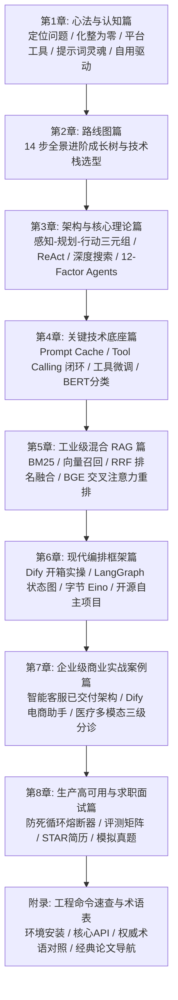

# AI Agent 全栈开发与商业落地教程（商业教辅交付版）

> **感谢您购买《AI Agent 全栈开发与商业落地教程》！**  
> 本套教程是针对“企业真实用工需求”与“商业级项目交付”打造的出版级实操教程。摒弃市面上常见的纯理论与玩具 Demo 拼凑，我们坚持**“是什么 $\rightarrow$ 为什么需要它 $\rightarrow$ 能做什么 $\rightarrow$ 手把手怎么做”**的保姆级 4 步教学法，带您从零手写 ReAct 引擎、搭建混合检索 RAG、掌握 LangGraph 状态图，并完整复盘 3 大千万级商用落地项目。

---

## 📦 4 合 1 豪华交付物矩阵

本资料包为您提供以下 4 种交付形态，满足离线学习、打印笔记、代码实战与网站部署全场景：

```
AI_Agent_全栈实战教辅资料包/
├── 📄 AI_Agent_全栈开发与商业落地教程_商业交付版.pdf  # [形态1] 高清出版级 PDF 手册（支持离线阅读与 A4 打印）
├── 📁 docs/                                        # [形态2] Markdown 完整图文源码（带 Mermaid 矢量图）
│   ├── index.md                                    # 知识门户总览大页
│   ├── guide/
│   │   ├── 01-mindset.md                           # 第1章：心法与认知篇
│   │   ├── 02-roadmap.md                           # 第2章：路线图篇（14步就业全景）
│   │   ├── 03-core-theory.md                       # 第3章：架构与核心理论篇
│   │   ├── 04-tech-foundations.md                  # 第4章：关键技术底座篇
│   │   ├── 05-rag-pipeline.md                      # 第5章：工业级混合 RAG 管道篇
│   │   ├── 06-frameworks.md                        # 第6章：现代编排框架篇 (Dify/LangGraph/Eino)
│   │   ├── 07-enterprise-cases.md                  # 第7章：企业商业实战案例篇 (三大千万级项目)
│   │   ├── 08-production-career.md                 # 第8章：生产高可用与求职面试篇
│   │   └── 09-appendix.md                          # 附录：工程速查命令与术语表
├── 💻 src/                                         # [形态3] 工业级独立源码库（开箱即跑，带详尽注释）
│   ├── 01_fastapi_sse_stream.py                    # 生产级 FastAPI SSE 流式打字机服务
│   ├── 02_native_react_engine.py                   # 原生 Python 纯手写 ReAct 决策推理引擎
│   ├── 03_openai_tool_calling.py                   # 标准 OpenAI Tool Calling 5步数据闭环
│   ├── 04_bert_intent_classifier.py                # PyTorch BERT 轻量网关意图分类器
│   ├── 05_hybrid_rag_pipeline.py                   # BM25 + 向量检索 + RRF 融合 + BGE 重排流水线
│   ├── 06_langgraph_workflow.py                    # LangGraph 状态图与 Human-in-the-loop 人机审批
│   ├── 07_medical_triage_disambiguate.py           # 医疗多模态问诊三级画像动态加权消歧
│   └── 08_circuit_breaker.py                       # 生产级防死循环熔断器 (Circuit Breaker)
└── 🌐 docs/.vitepress/dist/                        # [形态4] 预构建离线网站（无需联网，双击或单命令浏览）
```

---

## 🚀 极速上手使用指引

### 方式一：阅读离线打印版 PDF
- 直接双击打开根目录下的 `AI_Agent_全栈开发与商业落地教程_商业交付版.pdf`。
- 排版采用大厂规范设计，支持高亮标注与目录树跳转，适合多端离线研读。

### 方式二：浏览交互式文档站点
- **本地直接启动**：
  ```bash
  # 1. 进入教程根目录并安装依赖（如已安装可跳过）
  npm install

  # 2. 启动本地交互式热更新文档站
  npm run docs:dev
  ```
  控制台将输出 `http://localhost:5173/`，浏览器打开即可享受极致顺滑的阅读体验与代码一键复制功能。

### 方式三：运行与调试 `src/` 配套工程代码
所有代码均经过严格测试，无外部复杂黑盒依赖，直接在终端执行对应脚本即可查看控制台动态推理效果：
```bash
# 激活 Python 环境（推荐 Python 3.10+）
python src/01_fastapi_sse_stream.py          # 启动 SSE 流式服务
python src/02_native_react_engine.py         # 见证手写 ReAct 推理循环
python src/03_openai_tool_calling.py         # 体验标准 Tool Calling 闭环
python src/04_bert_intent_classifier.py      # 运行 BERT 极速意图网关
python src/05_hybrid_rag_pipeline.py         # 执行工业级混合检索与重排
python src/06_langgraph_workflow.py          # 运行状态图工作流与审批拦截
python src/07_medical_triage_disambiguate.py # 体验医疗画像动态加权消歧
python src/08_circuit_breaker.py             # 触发防死循环熔断保护
```

### 方式四：上架 GitHub 与一键部署到 Cloudflare Pages（站长模式）
本套教程已完整配置 Git 与 Cloudflare Pages 部署标准：
```bash
# 1. 打包静态生产站点产物
npm run docs:build

# 2. 一键推送到 Cloudflare 全球边缘节点发布
wrangler pages deploy docs/.vitepress/dist --project-name=ai-agent-tutorial
```

---

## 🎯 核心知识树全景导图



---

## 💡 商业交付版售后说明与学习建议

1. **先做减法，再做加法**：优先通读第 1、2 章，树立全局框架意识，不要陷入细节语法。
2. **动手敲一遍 `src/` 代码**：教程中的每个脚本都可以独立运行并直接移植到您的实际业务中。
3. **学以致用，打造专属作品集**：结合第 7 章的商业落地案例与第 8 章的 STAR 简历法，打造属于您的高壁垒技术项目。

祝您学有所成，顺利晋升 AI Agent 架构师！
