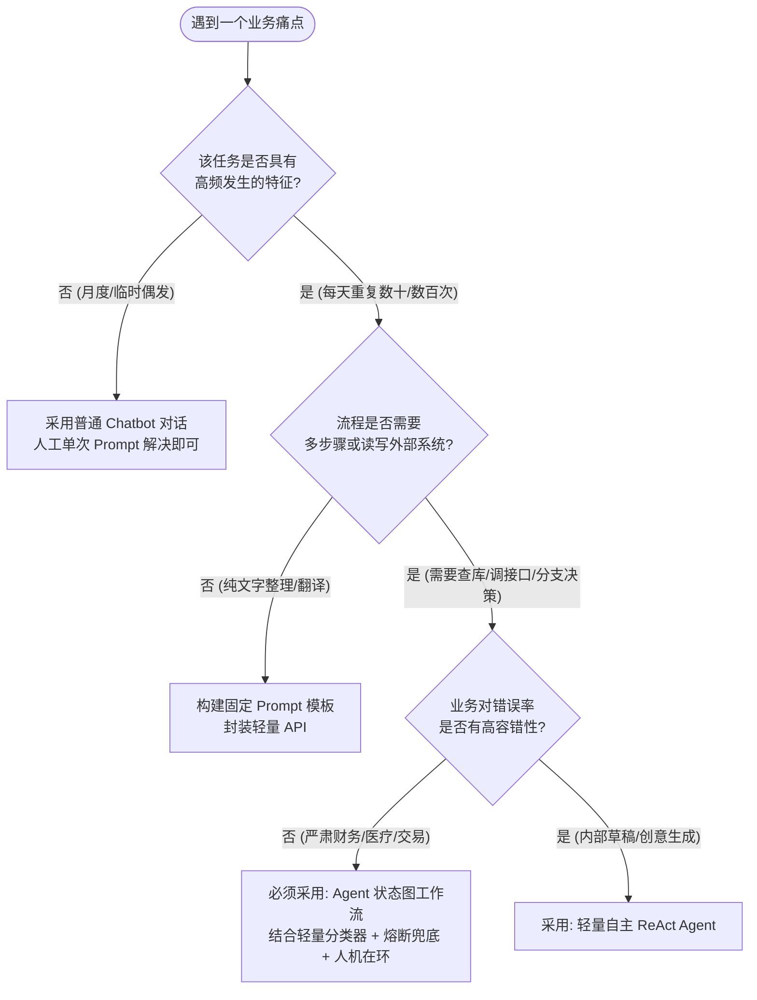

# 第 1 章：初识 AI Agent —— 智能体的底层认知与思维转变

> **本章核心目标**：从零建立对 AI Agent（人工智能体）的本质认知，搞清楚它与传统大模型对话（Chatbot）及传统代码系统的核心界限；掌握五大底层工程搭建心法，学会使用“决策树”判断一个业务问题是否真正值得用 Agent 解决，避开盲目手写单步长提示词的“工程死穴”。

---

## 一、 核心概念剖析：什么是 AI Agent？

### 1.1 生活化通俗比喻
如果把 **传统大语言模型（LLM）** 比作一个**“博览群书但闭门不出的学者”**：
- 你问他唐诗宋词、量子力学，他能引经据典、出口成章；
- 但如果你跟他说：“帮我查一下今天下午上海飞北京的最便宜航班，如果有合适的就直接帮我订一张，并且给我的项目经理发封请假邮件”，这位学者只能两手一摊：“抱歉，我不能联网，我没有操作手机或电脑的双手，我也不能替你花钱买票。”

而 **AI Agent（智能体）** 则是给这位学者配备了**“眼睛（感知能力）、双手（工具调用能力）、笔记本（长期与短期记忆）以及行动规划逻辑（决策系统）”**的**“全能数字员工”**：
- 他会自己先思考拆解：“我要先调用携程或航旅纵横的 API 查询航班 $\rightarrow$ 找出价格最低的一班 $\rightarrow$ 弹出确认框询问你是否同意支付 $\rightarrow$ 支付完成后自动调用企业微信或邮件接口发送假条通知”。

```mermaid
flowchart LR
    subgraph LLM[基础大语言模型 (LLM)]
        A[输入: 用户文本] --> B[核心: 文本概率预测] --> C[输出: 生成文本]
    end

    subgraph Agent[AI Agent 智能体系统]
        D[输入: 多模态感知] --> E[大脑: 规划 + 记忆 + 反思]
        E <--> F[工具: 查数据库 / 调接口 / 跑代码]
        E --> G[输出: 自主执行 + 环境状态变更]
    end
```

### 1.2 核心定义对照表

| 维度 | 传统程序代码 (Traditional Code) | 普通大模型对话 (LLM Chatbot) | AI Agent (人工智能体) |
| :--- | :--- | :--- | :--- |
| **驱动核心** | 预设硬编码规则 (`if-else`) | 提示词词频与概率统计预测 | 目标驱动（Goal-Driven）与自主推理循环 |
| **交互形式** | 静态界面点击 / 命令行入参 | 开放式单轮或多轮闲聊文本 | 自主感知输入、规划拆解、行动与环境反馈 |
| **外部能力** | 必须由工程师提前逐行写死 | 无法主动连接外部世界（封闭） | 能主动调用 API、读写数据库、执行系统命令 |
| **容错自愈** | 遇未捕获异常直接报错崩溃 | 容易产生幻觉胡说八道 | 具备自我反思（Reflection）与错误重试重试能力 |

---

## 二、 业务痛点与技术价值：为什么需要 AI Agent？

### 2.1 传统系统与单轮 Prompt 的致命死穴
1. **传统规则系统的“维护地狱”**：过去企业为了处理售后客服或业务审批，维护了数以万计的正则表达式和关键词路由树。一旦用户换一种口语化表述（如“我买的衣服太大了想换个码”与“能不能给我换个小号”），系统识别率暴跌，维护成本极高。
2. **大模型单次 Prompt 的“注意力迷失（Lost in the Middle）”**：许多开发者试图将复杂的业务流程（包含查库存、查物流、退款计算、合规审核）全部写进一段长达 3000 字的超级 Prompt 里。结果大模型顾头不顾尾，不仅幻觉频出，而且耗费极高的 Token 成本。
3. **不可控性与幻觉代价**：在金融、医疗、法律等严肃工业场景，直接把大模型的自由生成暴露给终端客户，可能因一条虚假承诺导致严重的商业赔偿或法律风险。

### 2.2 Agent 带来的核心突破
- **将“生成式 AI”升级为“行动式 AI（Action-Oriented AI）”**：不再仅仅满足于“写出一段文字”，而是真正完成现实业务闭环（如创建 Jira 工单、修改 ERP 订单状态、执行报表统计）。
- **确定性与灵活性的完美结合**：利用大模型处理非结构化的模糊意图，利用确定性的代码与工具接口（Tool Calling）执行严肃计算与数据读写，兼具人性的理解力与程序的严谨性。

---

## 三、 应用场景与能力矩阵：Agent 能做什么？

| 业务领域 | 传统人工/系统痛点 | Agent 解决方案 | 商业量化成效 |
| :--- | :--- | :--- | :--- |
| **企业高可用智能客服** | 人工客服夜间不可用，传统关键词匹配率不足 65% | 意图识别 + 知识库混合检索 + 对话状态机 + 自动查单 | 意图识别率超 **92%**，日均承接 10 万+ 会话，节约 **60% 人力** |
| **电商智能售后与导购** | 查物流、退换货政策解答占用 80% 人力，处理流程机械重复 | Dify 知识库助手 + 订单接口 Tool Calling + 情绪识别分流 | 售后工单自动化流转率达到 **75%**，首响延迟缩短至 1 秒以内 |
| **医疗智能辅助问诊** | 患者口语化主诉极其模糊，直接给大模型提问易引发危险误诊 | 多模态输入 + 医疗知识图谱 + 患者画像三级加权动态消歧 | 导诊准确率 **96%**，危急重症自动触发急诊绿色通道 |
| **深度市场研报与调研** | 分析师每天耗费 3~4 小时搜集整理竞品动态与行业资讯 | Deep Research 范式：大纲规划 $\rightarrow$ 搜索抓取 $\rightarrow$ 交叉事实校验 $\rightarrow$ 报告生成 | 原需 4 小时的初稿搜集工作压缩至 **10 分钟** 内自主完成 |
| **AI 辅助编程与代码 Review** | 业务边界校验繁重，单元测试覆盖率低，人工评审耗时 | Cursor / Claude 智能体：读取代码树 $\rightarrow$ 自动化执行测试 $\rightarrow$ 定向纠错 | 代码 Review 效率提升 **40%**，边缘异常分支测试覆盖率翻倍 |

---

## 四、 手把手实操指南：五大底层工程搭建心法

在动手写第一行代码前，建立严谨的工程思维是保证项目不烂尾的前提。

### 4.1 心法一：精准定位问题属性（一次性需求 vs 高频固定流程）

不是所有场景都需要 Agent。新手请严格按照下方的**场景筛选决策树**进行评估：



### 4.2 心法二：任务流程化整为零（从单节点打磨到工作流串联）
- **反模式**：写一个包含 20 条约束的巨型 Prompt：“你既要分析客户语气，又要提取订单号，还要计算运费，最后用表格输出”。
- **工程解法**：
  1. **节点 A（意图分类器）**：仅负责判断用户是咨询政策、查询订单还是投诉；
  2. **节点 B（槽位提取器）**：仅负责从文本中精准抽取出手机号或订单编号；
  3. **节点 C（工具执行器）**：仅负责发起 HTTP 请求查询真实物流；
  4. **节点 D（自然语言生成器）**：根据节点 C 的结果组织礼貌话术。
  - **核心好处**：每个节点均可独立写单元测试，哪个环节出错一清二楚，调试成本降低 90%。

### 4.3 心法三：善用平台工具与标准协议
- **拒绝从零造轮子**：
  - 验证原型（MVP）阶段，优先使用 **Dify** 或 **Coze**，几小时内即可完成知识库挂载与工作流验证；
  - 跨系统工具接入阶段，拥抱 **Anthropic MCP（Model Context Protocol）** 协议，一次编写，多端复用；
  - 核心业务生产阶段，使用 **LangGraph** 或字节开源的 **Eino** 进行强类型代码级控制。

### 4.4 心法四：提示词是系统的业务配置代码
提示词（Prompt）绝不是随性写就的“小作文”，而是工业级 Agent 的业务配置规约。一个生产级 Prompt 必须包含四大核心骨架：
1. **Role & Identity**（角色与专业权威定义）
2. **Workflow & Constraints**（执行流程与严格边界，明确禁止做什么）
3. **Few-Shot Examples**（少样本示例，尤其是异常与边界输入）
4. **Output Schema**（强制约束输出格式，推荐强类型 JSON）

### 4.5 心法五：先以自用为主的敏捷进阶
不要试图第一天就开发一套颠覆行业的超级系统。建议从身边的真实痛点起步：
- 例如：写一个“每日 GitHub 提交自动生成周报的 Agent”；
- 或者：“本地 Markdown 读书笔记精准检索问答 Agent”。
当工具在现实中真正为你节省了 30 分钟时间，你所获得的确定性正反馈将驱动你快速突破后续的复杂架构。

---

## 五、 生产避坑与常见误区（Troubleshooting FAQ）

### Q1：为什么我的 Agent 经常在中间某一步“自由发挥”，完全不理会我在提示词里的规则？
- **原因剖析**：提示词过长导致“注意力衰减（Lost in the Middle）”，或者多条约束之间存在逻辑冲突。
- **解决方案**：立即执行“化整为零”拆分，把长 Prompt 拆解为两个串联的 Node；同时对关键输出字段强制使用 JSON Schema 校验（如 Pydantic），阻断其自由发散。

### Q2：给大模型接入工具越多越好吗？
- **原因剖析**：当为一个 Agent 同时挂载超过 10~15 个工具时，大模型在选择工具时的“幻觉选择率”会呈指数上升，且 Tool Schema 会大幅吞噬上下文并增加首字延迟。
- **解决方案**：引入**路由层（Router Pattern）**或**技能渐进式披露（Progressive Disclosure）**，先由分类节点缩小工具候选范围，再向具体智能体动态注入相关的 2~3 个工具。

---

## 六、 本章课后实战作业（Lab Challenge）

1. **场景定性练习**：请挑选你当前工作或生活中的 3 个场景（例如：发票报销初审、撰写朋友圈文案、代码 Bug 自动化定位），使用本章提供的决策树画出它们的定性分析流程图。
2. **化整为零拆解练习**：针对“客户要求退换购买的数码相机”这一售后场景，将其拆解为 4 个职责独立的最小原子功能节点，并定义每个节点的标准输入与输出数据结构。
