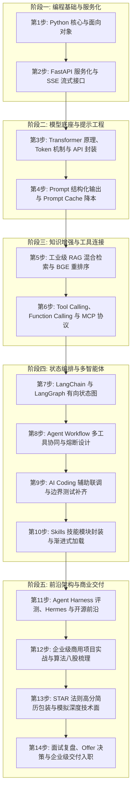

# 第 2 章：Agent 工程师成长全景图 —— 14 步逐级进阶指南

> **本章核心目标**：建立清晰完整的全栈 Agent 工程师技术知识图谱，彻底告别零散的碎片化学习；掌握现代 Python 工程化环境配置标准（基于 Astral `uv` 极速包管理）；手把手完成第一个具备生产级 Server-Sent Events（SSE）打字机流式输出能力的 Agent 后端接口。

---

## 一、 核心概念剖析：什么是全栈 Agent 工程师技能树？

在生成式 AI 时代，技术岗位正在发生深刻重塑：
- **纯提示词工程（Prompt Engineering）** 门槛极低，极易被自动化模型取代；
- **纯底层大模型预训练（Pre-training）** 集中在少数算力寡头手中，企业普通岗位稀缺；
- **全栈 Agent 工程师（AI Agent Full-Stack Engineer）** 成为目前产业界最为稀缺、薪资杠杆最高的核心岗位。他们向上理解业务场景与多模态交互，向下连接数据库、ERP 与外部 API，中间掌控有向状态图编排、容错熔断、混合检索与轻量模型微调。



---

## 二、 业务痛点与技术价值：为什么需要这 14 步路线？

### 2.1 碎片化学习的致命陷阱
许多开发者在学习 Agent 时往往直接复制一段 LangChain 快速教程，能跑通一个简单的问答就以为掌握了 Agent。然而一旦进入真实的商业交付，立刻遭遇断崖式挫折：
- **无法满足生产交互**：前端需要打字机流式回显，但接口只支持全量阻塞等待；
- **成本与延迟失控**：多轮会话没有做 Prompt Cache 和滑动窗口压缩，用户聊 10 轮账单翻数倍；
- **线上不可控崩溃**：外部工具调用返回 500 时，整个智能体陷入死循环重试直接打崩服务器。

这 14 步全景体系正是为了**补齐生产工程闭环中的每一个脆弱节点**，让每一位学习者具备承接企业商业级项目的底气。

---

## 三、 应用场景与能力矩阵：14 步逐级拆解与验收标准

| 阶段分类 | 进阶步骤 | 核心技术点与工具链 | 达标自测验收标准 |
| :--- | :--- | :--- | :--- |
| **阶段一<br>编程与服务** | **第 1 步：Python 核心** | 类型提示 `typing`、面向对象、异步协程 `asyncio`、`Pydantic v2` 数据校验 | 能熟练手写带字段约束与自定义校验器的 DTO 模型 |
| | **第 2 步：FastAPI 服务化** | RESTful 路由、CORS 跨域、SSE（Server-Sent Events）打字机流式传输 | 能在终端通过 `curl -N` 实时接收到流式思考与答案分块 |
| **阶段二<br>底座与提示** | **第 3 步：Transformer 机制** | Tokenization 分词（BPE）、KV Cache 原理、Context Window、API 超参数（Temperature） | 能精准计算请求 Token 成本并分析不同 Temperature 行为 |
| | **第 4 步：Prompt Cache** | JSON Mode 强约束输出、System Prompt 前缀固定、Prompt Cache 命中优化 | 首字延迟降低 60% 以上，大模型输出 100% 为可解析 JSON |
| **阶段三<br>知识与工具** | **第 5 步：工业级 RAG** | 文档分块（Chunking）、Embedding 向量化、BM25 + 向量混合检索、BGE-Reranker | 面对含专有型号代码的生僻条款，Top-3 召回率达到 90%+ |
| | **第 6 步：Tool Calling** | OpenAI Function Calling 规范、本地工具注册分发闭环、Anthropic MCP 协议 | 能够让模型调用本地 Python 函数查天气/订单并整合回复 |
| **阶段四<br>框架与编排** | **第 7 步：LangGraph 状态图** | `StateGraph`、`Node`、`Edge`、条件路由（Conditional Edge）、循环迭代 | 能够用状态图构建带条件判断与工具回环调用的复杂工作流 |
| | **第 8 步：Workflow 健壮性** | Router 模式、并发工具调用、最大轮次限制与防死循环熔断器 | 外部 API 发生异常时系统能优雅降级而不是直接抛异常崩溃 |
| | **第 9 步：AI Coding 进阶** | Cursor / Claude Code 联动、自动化生成 Pytest 测试用例、模糊攻击测试 | 核心业务路由与参数解析代码单元测试覆盖率达 80%+ |
| | **第 10 步：Skills 封装** | 技能元数据规约、能力渐进式披露加载（Progressive Disclosure） | 实现技能动态加载，避免不相关工具污染上下文与增加开销 |
| **阶段五<br>交付与通关** | **第 11 步：开源前沿架构** | Agent Harness 沙箱隔离、SWE-bench 评测体系、AutoGPT/SuperAGI 架构 | 能深入研读前沿自主 Agent 开源仓库的 Event Loop 源码 |
| | **第 12 步：企业级商用实战** | 智能客服系统交付、Dify 电商助手、医疗智能问诊系统端到端实操 | 能够独立画出千万级高可用 Agent 架构图并阐述技术权衡 |
| | **第 13 步：简历与模拟面试** | STAR 法则技术包装、业务难点与量化收益表述、多轮模拟面试演练 | 形成一份拥有 2 个以上商业级壁垒项目的顶尖高分简历 |
| | **第 14 步：复盘与 Offer 决策** | Bad Case 追踪表复盘、系统设计题查缺补漏、职级薪资评估 | 掌握不同团队业务真实性与算力支持度的甄别方法 |

---

## 四、 手把手实操指南：环境搭建与流式接口开发

### 4.1 现代 Python 工程环境从零搭建（基于 Astral `uv`）

在生产级开发中，严禁在全局 Python 环境下滥用 `pip install`。推荐使用目前业内速度最快的包管理神器 **`uv`**（比传统 pip/poetry 快 10~100 倍）：

```bash
# 1. 终端一行命令安装 uv (支持 macOS/Linux)
curl -LsSf https://astral.sh/uv/install.sh | sh

# 2. 检查安装版本
uv --version

# 3. 初始化项目并自动创建虚拟环境
uv init ai-agent-core
cd ai-agent-core

# 4. 一键安装全栈开发核心依赖
uv add fastapi "uvicorn[standard]" pydantic httpx openai python-dotenv
```

---

### 4.2 生产级 FastAPI SSE 流式打字机服务实现

用户使用 Agent 时，单次思考和调用工具往往需要 2~5 秒。如果采用传统阻塞响应，用户只能对着白屏等待，体验极差。**必须使用 Server-Sent Events（SSE）提供打字机流式回显**。

在项目根目录下创建 `src/01_fastapi_sse_stream.py` 文件：

```python
"""
文件名：src/01_fastapi_sse_stream.py
说明：生产级 FastAPI + SSE (Server-Sent Events) 打字机流式服务标准实现
运行方式：uv run uvicorn src.01_fastapi_sse_stream:app --reload --port 8000
"""

from fastapi import FastAPI, Query
from fastapi.middleware.cors import CORSMiddleware
from fastapi.responses import StreamingResponse
import asyncio
import json
from datetime import datetime

app = FastAPI(
    title="AI Agent Production Streaming Service",
    description="支持思考轨迹追踪与实时自然语言打字机的标准接口",
    version="1.0.0"
)

# 生产环境跨域安全配置
app.add_middleware(
    CORSMiddleware,
    allow_origins=["*"],  # 生产环境请指定具体的前端域名
    allow_credentials=True,
    allow_methods=["*"],
    allow_headers=["*"],
)

async def agent_execution_generator(user_query: str):
    """
    模拟 Agent 完整的思考、工具调用与答案生成全链路事件流
    """
    # 阶段 1：接收并解析意图
    stage_1 = {
        "event_id": 1,
        "type": "thought",
        "stage": "intent_parsing",
        "timestamp": datetime.now().isoformat(),
        "message": f"正在深度分析用户需求：'{user_query}'，识别到包含查单与政策咨询双重意图..."
    }
    yield f"data: {json.dumps(stage_1, ensure_ascii=False)}\n\n"
    await asyncio.sleep(0.6)

    # 阶段 2：规划并调用工具
    stage_2 = {
        "event_id": 2,
        "type": "tool_call",
        "stage": "action_execution",
        "tool_name": "query_order_status",
        "arguments": {"order_id": "20260901"},
        "message": "正在请求内部 ERP 接口查询订单 [20260901] 的最新物流动态..."
    }
    yield f"data: {json.dumps(stage_2, ensure_ascii=False)}\n\n"
    await asyncio.sleep(0.8)

    # 阶段 3：观察外部返回
    stage_3 = {
        "event_id": 3,
        "type": "observation",
        "stage": "data_received",
        "result": {"status": "运输中", "hub": "华东中心转运站", "courier": "顺丰特快"},
        "message": "接口返回成功：包裹正处于顺丰特快陆运中，预计今日 18:00 送达。"
    }
    yield f"data: {json.dumps(stage_3, ensure_ascii=False)}\n\n"
    await asyncio.sleep(0.5)

    # 阶段 4：自然语言打字机流式输出最终答复
    final_answer = (
        "您好！为您查询到订单号 20260901 的最新进展如下：\n\n"
        "1. 物流承运：顺丰特快\n"
        "2. 当前位置：已到达【华东中心转运站】，正在进行分拣派发\n"
        "3. 预计送达：今天下午 18:00 前完成送货上门\n\n"
        "请您保持手机畅通，如有其他疑问可随时告诉我！"
    )
    
    # 逐字拆包打字机推送
    for char in final_answer:
        chunk = {
            "type": "answer_chunk",
            "content": char
        }
        yield f"data: {json.dumps(chunk, ensure_ascii=False)}\n\n"
        await asyncio.sleep(0.03)  # 模拟自然的打字手感

    # 结束标志
    yield f"data: {json.dumps({'type': 'done'})}\n\n"

@app.get("/api/v1/agent/chat")
async def chat_stream_endpoint(query: str = Query(..., description="用户的提问内容")):
    """
    对外暴露的标准 SSE 流式通信端点
    """
    return StreamingResponse(
        agent_execution_generator(query),
        media_type="text/event-stream",
        headers={
            "Cache-Control": "no-cache",
            "Connection": "keep-alive",
            "X-Accel-Buffering": "no"  # 关键：通知 Nginx/网关不要对流式内容进行缓冲
        }
    )

if __name__ == "__main__":
    import uvicorn
    uvicorn.run("src.01_fastapi_sse_stream:app", host="127.0.0.1", port=8000, reload=True)
```

---

### 4.3 验证运行步骤与测试命令

打开终端执行以下命令启动服务：

```bash
# 启动 FastAPI 开发服务器
uv run uvicorn src.01_fastapi_sse_stream:app --reload --port 8000
```

打开另一个终端窗口，使用带有 `-N`（禁用缓冲）参数的 `curl` 进行测试：

```bash
curl -N "http://127.0.0.1:8000/api/v1/agent/chat?query=我的订单20260901到哪了"
```

你将在终端中亲眼看到流式数据按照 `data: {"type": ...}` 的格式连续推送，前端界面使用原生的 `const es = new EventSource(...)` 即可无缝渲染动态打字机效果。

---

## 五、 生产避坑与常见误区（Troubleshooting FAQ）

### Q1：为什么本地测试打字机效果正常，部署到线上（经过 Nginx 或 Cloudflare）后却变成了等全量回答生成完才一下子全部吐出来？
- **原因剖析**：Nginx 等反向代理服务器默认开启了 `proxy_buffering on`，网关会把后端返回的数据在内存里攒够一定大小（如 4KB）才下发给前端。
- **解决方案**：在 FastAPI 的响应头中必须注入：`"X-Accel-Buffering": "no"`；同时在 Nginx 配置中增加：
  ```nginx
  proxy_buffering off;
  proxy_cache off;
  ```

### Q2：`uv` 虚拟环境与 IDE（如 Cursor / VS Code）解析器不一致怎么办？
- **解决方案**：在 IDE 的命令面板（`Cmd + Shift + P`）中输入 `Python: Select Interpreter`，选择当前工程目录下的 `.venv/bin/python` 即可完成完美智能提示。

---

## 六、 本章课后实战作业（Lab Challenge）

1. **动手实践**：在本地成功运行 `01_fastapi_sse_stream.py`，并使用终端 `curl -N` 成功接收到完整的打字机输出流。
2. **拓展改造**：在 `agent_execution_generator` 中增加一个异常状态类型 `{"type": "error", "code": 500, "message": "ERP 接口超时"}`，并编写一段模拟异常发生时的优雅降级响应逻辑。
