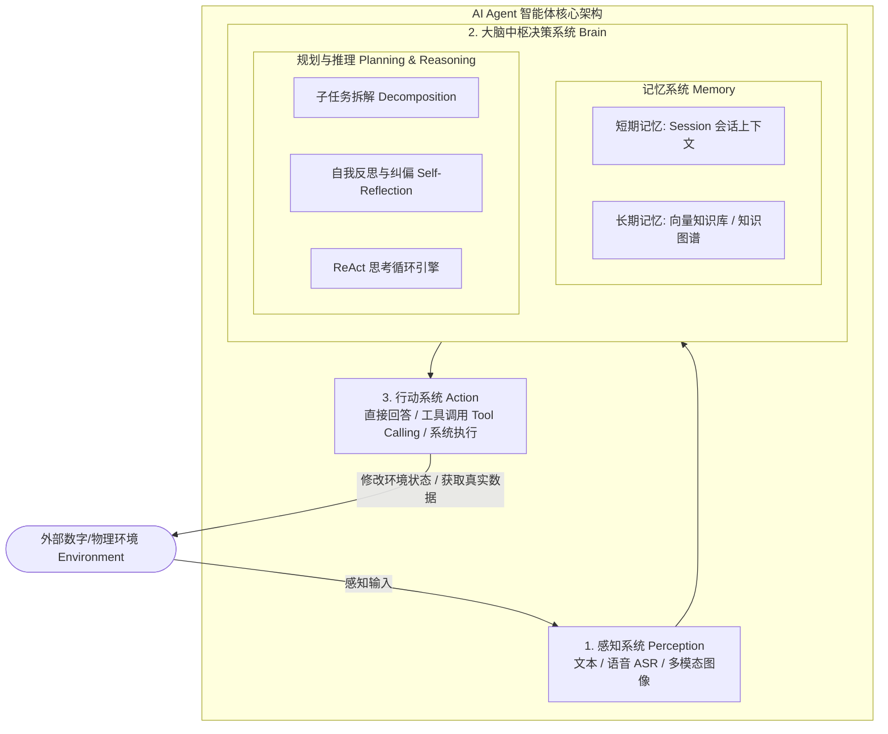
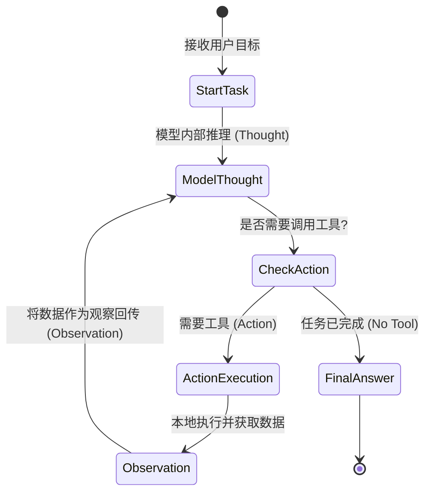
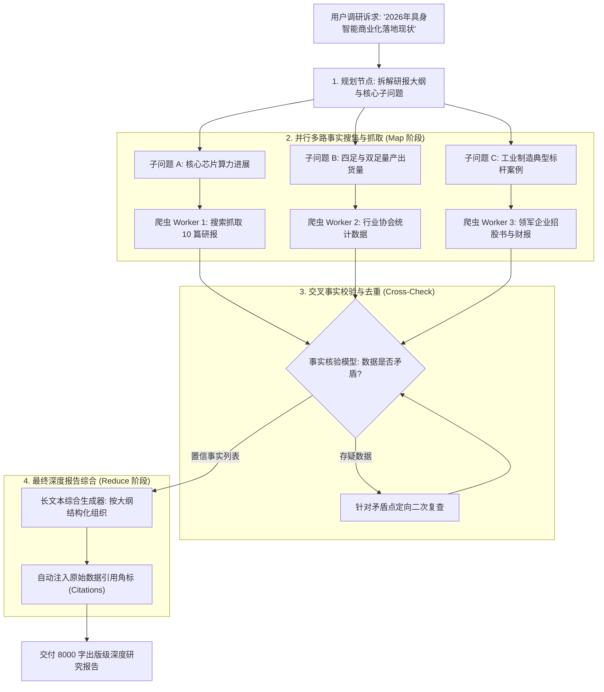
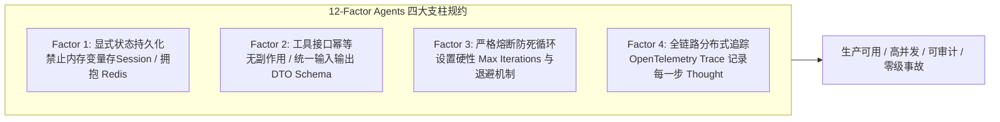

# 第 3 章：Agent 核心决策大脑 —— 感知、规划、行动与记忆

> **本章核心目标**：深入掌握大模型智能体经典理论架构，系统剖析感知（Perception）、大脑规划（Brain: Planning & Memory）、行动（Action）三元组运作机理；掌握短期与长期记忆工程化设计；手把手使用原生 Python 编写一个不依赖任何重型三方框架的 ReAct 自主推理引擎，亲手跑通第一条完整的“思考-行动-观察”闭环。

---

## 一、 核心概念剖析：经典 Agent 决策三元组与记忆体系

### 1.1 经典 Agent 理论框架（Lilian Weng 架构体系）
由前 OpenAI 研究主管 Lilian Weng 提出的经典 Agent 模型，是全球 AI 工业界公认的标准范式。一个具备自主能力的智能体由四大关键支柱驱动：



1. **感知层（Perception）**：系统的“感官”，负责接收来自环境的复杂非结构化信号（如用户提问文本、微信语音 ASR 识别结果、化验单图片 OCR 结果），将其规整为大模型可消费的标准 Token 序列。
2. **大脑决策系统（Brain）**：
   - **规划能力（Planning）**：负责“谋定而后动”。面对复杂目标时，自动进行子任务拆分、路径评估与自我反思纠偏；
   - **记忆能力（Memory）**：
     - **短期记忆（Short-term Memory）**：维护单次会话（Session）中上下文的动态流动与中间变量；
     - **长期记忆（Long-term Memory）**：借助向量数据库或外部知识库，跨会话持久化存储领域规则、历史操作与用户个性化画像。
3. **行动层（Action）**：系统的“双手”，根据大脑给出的决策指令，对外部环境产生实际影响（如调用高德 API 查路线、调用内部 ERP 改单、或者直接生成回复）。

---

## 二、 业务痛点与技术价值：为什么需要大脑规划？

### 2.1 无状态大模型的痛点
大语言模型本质上是**无状态（Stateless）的条件概率预测器**：
- 如果你要求它：“查一下明天北京天气，如果下雨就帮我向主管申请取消明天上午的拜访”，普通对话模型只能凭空编造一个虚假的下雨情况，或者回答“我没有权限访问天气网”；
- 它无法自主判断**“第一步查天气 → 第二步根据天气判断是否发邮件 → 第三步生成执行报告”**这一连续的逻辑因果链。

### 2.2 ReAct 范式的革命性价值
ReAct 论文（Synergizing Reasoning and Acting in Language Models）提出了将**推理（Reasoning）**与**行动（Acting）**交替进行的机制：
- **Thought（思考）**：大模型先向内审视现状：“我当前需要查询北京明天的天气预报”；
- **Action（行动）**：决定调用具体工具：“触发 `get_weather(city='北京', date='tomorrow')`”；
- **Observation（观察）**：本地系统执行工具并将真实结果注入模型：“返回晴天，26度”；
- **Next Thought（后续思考）**：“观察到明天晴天并未下雨，因此无需申请取消拜访”；
- **Final Answer（最终输出）**：“明天北京晴天，您的拜访行程可照常进行”。



---

## 三、 应用场景与能力矩阵：规划算法与 12-Factor Agents 原则

### 3.1 规划算法能力对比

| 规划模式 | 工作机制 | 适用业务场景 | 复杂度与延迟 |
| :--- | :--- | :--- | :--- |
| **ReAct 循环** | 单步交替思考与行动，实时根据上一步结果纠偏 | 智能客服查单、多条件查询、自动化运维排障 | 延迟适中（2~5次调用），灵活性极强 |
| **Plan-and-Solve** | 一次性规划出全部执行步骤（Step 1~N），再按步骤依次执行 | 流程高度固定的数据迁移、自动化代码重构 | 首步思考耗时长，中途纠偏能力弱于 ReAct |
| **Deep Research** | 大纲拆解 → 并行多路搜索抓取 → 交叉事实核查 → 深度长文综合 | 行业深度研报撰写、竞品全景调研、学术综述 | 执行轮次多（5~15轮），信息丰富度极高 |

#### Deep Research 范式多路并行执行拓扑



### 3.2 生产级设计准则：12-Factor Agents 核心要义

借鉴现代微服务 12-Factor 哲学，工业级 Agent 必须遵守以下原则：



1. **显式状态管理**：会话状态不保存在本地内存变量中，必须持久化在 Redis 或 PostgreSQL 状态机；
2. **工具无状态化**：每个 Tool 接口必须幂等，入参自包含，不产生未受控的副作用；
3. **强制循环熔断**：必须为每一个 Agent 会话设置 `max_steps`（最大步数限制，建议 5~8 次），严禁无休止死循环；
4. **全链路 Trace 观测**：每一次 Thought、Action 和 Observation 都必须记录 Trace ID，确保可排查、可审计。

---

## 四、 手把手实操指南：手写原生 Python ReAct 引擎

为了让新手彻底看懂底层原理，本节**不依赖 LangChain 或任何三方框架**，直接使用原生 Python 和 OpenAI 官方 SDK 编写一个完整的 ReAct 运行循环。

在项目根目录创建 `src/02_native_react_engine.py` 文件：

```python
"""
文件名：src/02_native_react_engine.py
说明：纯原生 Python 手写实现工业级 ReAct (Reason + Act) 规划循环引擎
运行方式：uv run python src/02_native_react_engine.py
"""

import os
import json
from typing import Callable, Dict, Any, List
from openai import OpenAI
from dotenv import load_dotenv

# 加载 .env 环境变量
load_dotenv()

client = OpenAI(
    api_key=os.getenv("OPENAI_API_KEY", "your-api-key-here"),
    base_url=os.getenv("OPENAI_BASE_URL", "https://api.openai.com/v1")
)

# ----------------- 1. 定义真实外部业务工具 -----------------
def get_current_weather(location: str) -> Dict[str, Any]:
    """模拟查询指定城市实时天气的工具"""
    fake_weather_db = {
        "北京": {"temp": "24°C", "condition": "晴朗", "humidity": "45%"},
        "上海": {"temp": "28°C", "condition": "大雨", "humidity": "85%"},
        "深圳": {"temp": "31°C", "condition": "多云", "humidity": "70%"}
    }
    return fake_weather_db.get(location, {"temp": "22°C", "condition": "多云", "humidity": "50%"})

def calculate_ticket_price(origin: str, destination: str, is_high_speed: bool = True) -> Dict[str, Any]:
    """模拟计算两地之间火车票价的工具"""
    return {
        "route": f"{origin} -> {destination}",
        "type": "高铁二等座" if is_high_speed else "普通卧铺",
        "price_rmb": 553.0 if is_high_speed else 280.0,
        "available_seats": 12
    }

# ----------------- 2. 工具元数据注册表 (Tools Schema) -----------------
TOOL_SCHEMAS = [
    {
        "type": "function",
        "function": {
            "name": "get_current_weather",
            "description": "获取指定城市的实时天气、气温与湿度信息",
            "parameters": {
                "type": "object",
                "properties": {
                    "location": {
                        "type": "string",
                        "description": "城市中文名称，例如：北京、上海、深圳"
                    }
                },
                "required": ["location"]
            }
        }
    },
    {
        "type": "function",
        "function": {
            "name": "calculate_ticket_price",
            "description": "查询两个城市之间火车票票价与余票情况",
            "parameters": {
                "type": "object",
                "properties": {
                    "origin": {"type": "string", "description": "出发城市"},
                    "destination": {"type": "string", "description": "到达城市"},
                    "is_high_speed": {"type": "boolean", "description": "是否为高铁动车，默认为 True"}
                },
                "required": ["origin", "destination"]
            }
        }
    }
]

# 本地可执行函数映射字典
FUNCTION_MAP: Dict[str, Callable] = {
    "get_current_weather": get_current_weather,
    "calculate_ticket_price": calculate_ticket_price
}

# ----------------- 3. 原生 ReAct 核心引擎实现 -----------------
def execute_react_agent(user_prompt: str, max_iterations: int = 5) -> str:
    """
    原生实现的 ReAct 运行循环
    :param user_prompt: 用户的初始任务描述
    :param max_iterations: 最大安全循环次数，防止死循环
    """
    print(f"\n🚀 [Agent 任务启动] 用户目标: {user_prompt}")
    
    # 初始化会话上下文与专业系统提示词
    messages: List[Dict[str, Any]] = [
        {
            "role": "system",
            "content": (
                "你是一个严谨务实的旅行与出行助手 AI Agent。\n"
                "当你面对用户目标时，请遵循 ReAct 决策模式：\n"
                "1. 在调用工具前，明确你的思考目标 (Thought)；\n"
                "2. 根据真实需要选择调用最合适的工具 (Action)；\n"
                "3. 基于工具返回的事实数据进行下一步推理 (Observation)；\n"
                "4. 最终以结构清晰、友善的自然语言给出最终答复 (Final Answer)。"
            )
        },
        {"role": "user", "content": user_prompt}
    ]

    iteration = 0
    while iteration < max_iterations:
        iteration += 1
        print(f"\n--- [第 {iteration} 轮迭代推理] ---")

        # 触发大模型推理
        response = client.chat.completions.create(
            model="gpt-4o",
            messages=messages,
            tools=TOOL_SCHEMAS,
            tool_choice="auto"
        )
        
        message = response.choices[0].message
        messages.append(message)

        # 判断模型是否决定调用工具
        if message.tool_calls:
            for tool_call in message.tool_calls:
                func_name = tool_call.function.name
                func_args = json.loads(tool_call.function.arguments)
                
                print(f"👉 [Agent Action] 决定调用工具: {func_name}")
                print(f"   参数内容: {func_args}")

                # 本地执行对应 Python 函数
                target_func = FUNCTION_MAP.get(func_name)
                if target_func:
                    tool_output = target_func(**func_args)
                else:
                    tool_output = {"error": f"工具 {func_name} 未在本地注册"}

                print(f"👁️ [Agent Observation] 工具返回数据: {tool_output}")

                # 将工具执行结果作为 role: tool 追加至上下文
                messages.append({
                    "role": "tool",
                    "tool_call_id": tool_call.id,
                    "name": func_name,
                    "content": json.dumps(tool_output, ensure_ascii=False)
                })
        else:
            # 没有触发工具调用，说明 Agent 已经得出最终结论
            print(f"\n✅ [任务顺利闭环] Agent 生成最终答复：")
            return message.content

    return "⚠️ 警告：Agent 达到最大推理迭代限制，为保障安全已终止执行并转人工审核。"

# ----------------- 4. 本地测试运行 -----------------
if __name__ == "__main__":
    test_query = "我想明天从北京去上海出差，帮我看下上海现在的天气适不适合出行，另外算一下高铁二等座票价大概多少钱？"
    # 如果没有配置真实的 API KEY，则打印演示说明
    if os.getenv("OPENAI_API_KEY") in [None, "", "your-api-key-here"]:
        print("💡 提示：请在 .env 文件中配置真实的 OPENAI_API_KEY 即可实际执行大模型推理测试！")
    else:
        final_result = execute_react_agent(test_query)
        print(final_result)
```

---

## 五、 生产避坑与常见误区（Troubleshooting FAQ）

### Q1：为什么模型在某些情况下会用一模一样的参数反复调用同一个工具，导致卡死在循环里？
- **原因剖析**：这是典型的“参数震荡与无进展循环（Stagnant Looping）”。通常发生在工具返回了错误信息（例如 `404 Not Found`），而模型的 Prompt 中缺乏对错误信息的处理指引，导致它认为再次请求就能成功。
- **解决方案**：
  1. 在工具返回中明确告诉模型原因，如 `{"error": "城市名称拼写错误，请检查输入"}`；
  2. 必须在系统代码中引入**防死循环熔断器（Circuit Breaker）**：如果连续 2 次调用相同工具与相同参数，直接强制中断并降级。

### Q2：对话轮次越来越多，Context Window 快爆了怎么办？
- **解决方案**：引入**滑动窗口剪枝与滚动摘要机制（Context Pruning & Summarization）**：
  - 只保留最近 4 轮的完整 Message 原貌；
  - 4 轮之前的所有历史会话，交由后台轻量模型压缩成一段 200 字的 `Context Summary` 置于最前。

---

## 六、 本章课后实战作业（Lab Challenge）

1. **动手实践**：在本地配置自己的 API Key 并运行 `02_native_react_engine.py`，观察控制台中输出的每一轮 `Thought`、`Action`、`Observation`。
2. **扩展工具实战**：为上述代码新增第三个工具 `get_hotel_recommendation(city: str, max_price: int)`（查询酒店推荐），修改用户的提问：“我想去深圳，查下深圳天气并推荐 500 元以内的酒店”，验证 Agent 是否能自主识别并完成多工具协同调用。
