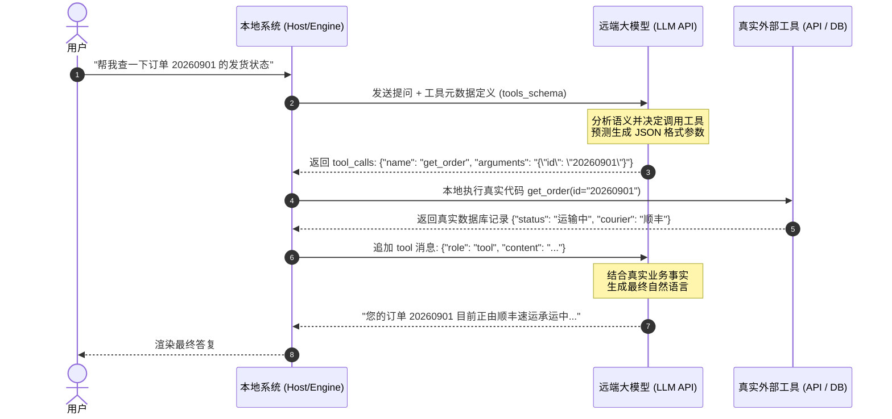

# 第 4 章：连接现实世界 —— Tool Calling 与大模型微调实操

> **本章核心目标**：彻底理解 Tool / Function Calling 的底层本质（为什么大模型绝对不会直接运行你的系统代码）；掌握工业级 JSON Schema 编写技巧与 5 步数据交互全闭环；掌握开源大模型工具微调（XTuner 规范）与在网关层使用轻量级 BERT 模型拦截 60% 高频请求实现大幅降本的核心工程方案。

---

## 一、 核心概念剖析：Tool Calling 与微调的底层真相

### 1.1 核心真相：大模型到底是如何“调用工具”的？
初学者最大的误区之一是以为“大模型成精了，能够直接侵入服务器去跑一段 Python 脚本或连进 MySQL”。

**底层真相只有一句话：大语言模型（LLM）从头到尾只做了一件事 —— 文本概率预测与结构化 JSON 生成。**

真正的工具调用全流程如下：
1. **开发者**：向大模型提供两份信息 —— 用户的问题 + 一份描述工具功能的“说明书（JSON Schema）”；
2. **大模型**：根据用户语义和说明书，计算概率并生成一段符合格式的 JSON 字符串（例如：`{"name": "query_order", "arguments": "{\"order_id\": \"9876\"}"}`）；
3. **宿主系统（Host，即你写的后端代码）**：拦截到大模型的返回，解析该 JSON，**由你的 Python 代码在安全的本地/内网环境中真正发起网络请求或数据库查询**；
4. **宿主系统**：拿到真实的查询结果（如 `{"status": "已发货", "express": "顺丰"}`），将其包装成一条带特殊标识（`role: tool`）的消息塞回给模型；
5. **大模型**：结合真实数据，组织语言输出最终答复。



---

## 二、 业务痛点与技术价值：为什么需要双轨制分流与微调？

### 2.1 全量大模型调用的“成本与延迟刺客”
在日均 10 万次会话的企业智能客服中：
- 用户发送大量的“你好”、“早上好”、“人工客服呢”、“谢谢”等简单高频输入；
- 如果每一条请求都直接唤醒 70B 参数的大模型并全量传入上万 Tokens 的工具 Schema，单次请求耗时高达 1.5~3 秒，单日 Token 消耗费用极其惊人。

### 2.2 解决方案：网关层双轨制（Dual-Track Routing）
```mermaid
flowchart TD
    Req[用户请求到达网关] --> Gate[网关前置: 轻量 BERT 分类器 (耗时 < 15ms)]
    Gate --> Judge{置信度与意图分类}
    Judge -- 高频固定意图 (如: 打招呼/人工直转) --> CacheResp[直接走本地预设模板/规则回复\n(零 Token 成本 / 15ms 极速响应)]
    Judge -- 复杂业务/多轮意图 (如: 售后查单/政策咨询) --> AgentCore[转发至大模型 Agent 核心\n(结合 Tool Calling 与 RAG 深度推理)]
```
- **核心收益**：**在网关层毫秒级拦截 60% 以上的无用 Token 消耗**，将企业大模型服务器资源集中留给需要复杂推理的长尾疑难问题，整体降本达 **60% 以上**。

---

## 三、 应用场景与能力矩阵：Tool Calling 能做什么？

| 工具类型 | 典型调用场景 | 工具入参 (Parameters) | 预期产出与业务影响 |
| :--- | :--- | :--- | :--- |
| **查询类工具 (Query Tools)** | 物流查单、库存检索、个人账单明细 | `order_id`, `sku_code`, `date_range` | 返回只读数据，无副作用，高并发读 |
| **操作类工具 (Mutation Tools)** | 提交退款、修改收货地址、取消预约 | `order_id`, `reason`, `new_address` | 会修改业务数据库，需人机二次确认 |
| **计算类工具 (Compute Tools)** | 汇率换算、税金扣减、房贷月供核算 | `principal`, `rate`, `months` | 保证 100% 数学严谨，消灭大模型算术幻觉 |
| **外部通信工具 (Notification)** | 触发短信验证码、钉钉群通知、发邮件 | `receiver`, `template_id`, `body` | 跨系统联动与多端用户触达 |

---

## 四、 手把手实操指南：标准闭环代码与前置分类器

### 4.1 OpenAI Function Calling 标准闭环工程实现

创建 `src/03_openai_tool_calling.py`：

```python
"""
文件名：src/03_openai_tool_calling.py
说明：标准 OpenAI 协议 Tool Calling 原生 5 步闭环可运行实现
运行方式：uv run python src/03_openai_tool_calling.py
"""

import os
import json
from openai import OpenAI
from dotenv import load_dotenv

load_dotenv()
client = OpenAI()

# 1. 本地真实业务函数
def refund_order_api(order_id: str, reason: str) -> dict:
    """真实 ERP 退款发起接口"""
    print(f"\n[真实系统执行] 正在处理退款: 订单号={order_id}, 退款原因={reason}")
    return {
        "status": "success",
        "order_id": order_id,
        "refund_amount": 299.00,
        "refund_ticket_id": "RF20260923001",
        "notice": "退款申请已受理，预计 1-3 个工作日退回原支付账户。"
    }

# 2. 工具元数据规约 (符合 JSON Schema 规范)
TOOLS_CONFIG = [
    {
        "type": "function",
        "function": {
            "name": "refund_order_api",
            "description": "当用户明确要求对指定订单发起退款时调用本接口",
            "parameters": {
                "type": "object",
                "properties": {
                    "order_id": {
                        "type": "string",
                        "description": "8位数字订单流水号，例如 20260901"
                    },
                    "reason": {
                        "type": "string",
                        "description": "用户陈述的退款具体原因，例如：尺码不合、质量问题、误购"
                    }
                },
                "required": ["order_id", "reason"]
            }
        }
    }
]

def run_tool_calling_flow(user_input: str):
    print(f"\n--- [收到用户输入] {user_input} ---")
    messages = [
        {"role": "system", "content": "你是一家品牌官方旗舰店的售后 AI Agent。如果用户要求退款且提供了订单号与原因，请调用退款接口。"},
        {"role": "user", "content": user_input}
    ]

    # 第 1 步：大模型分析并输出工具调用指令
    response = client.chat.completions.create(
        model="gpt-4o",
        messages=messages,
        tools=TOOLS_CONFIG,
        tool_choice="auto"
    )
    msg = response.choices[0].message
    messages.append(msg)

    # 第 2 步：判断是否产生 tool_calls
    if msg.tool_calls:
        for tool_call in msg.tool_calls:
            func_name = tool_call.function.name
            func_args = json.loads(tool_call.function.arguments)
            print(f"👉 模型识别需要调用: {func_name}，解析出参数: {func_args}")

            # 第 3 步：本地调度执行真实函数
            if func_name == "refund_order_api":
                result = refund_order_api(**func_args)
            else:
                result = {"error": "未定义工具"}

            # 第 4 步：回传 tool 观察结果
            messages.append({
                "role": "tool",
                "tool_call_id": tool_call.id,
                "name": func_name,
                "content": json.dumps(result, ensure_ascii=False)
            })

        # 第 5 步：模型基于真实业务数据生成最终礼貌回复
        final_resp = client.chat.completions.create(
            model="gpt-4o",
            messages=messages
        )
        return final_resp.choices[0].message.content
    else:
        return msg.content

if __name__ == "__main__":
    if not os.getenv("OPENAI_API_KEY"):
        print("💡 演示说明：配置 OPENAI_API_KEY 后即可运行真实的 GPT-4o 5步工具调用闭环！")
    else:
        print(run_tool_calling_flow("你好，我的订单 20260901 衣服买大了一号，帮我申请全额退款。"))
```

---

### 4.2 网关层轻量 BERT 意图分类器实现（PyTorch）

创建 `src/04_bert_intent_classifier.py`：

```python
"""
文件名：src/04_bert_intent_classifier.py
说明：基于 PyTorch + HuggingFace Transformers 实现网关层毫秒级前置意图分类器
运行方式：uv run python src/04_bert_intent_classifier.py
"""

import torch
import torch.nn as nn
from transformers import BertModel, BertTokenizer

class GatewayBertClassifier(nn.Module):
    """
    轻量前置意图分类器：
    分类标签：0: 闲聊寒暄, 1: 售后退换, 2: 查单物流, 3: 投诉转人工
    推理耗时：GPU 模式下约 8~15ms，极大缓解后端大模型并发压力
    """
    def __init__(self, pretrained_model_name: str = "bert-base-chinese", num_classes: int = 4):
        super().__init__()
        self.bert = BertModel.from_pretrained(pretrained_model_name)
        self.dropout = nn.Dropout(0.2)
        # 将 BERT 输出的 768 维语义向量映射为业务分类类别数
        self.classifier = nn.Linear(self.bert.config.hidden_size, num_classes)

    def forward(self, input_ids: torch.Tensor, attention_mask: torch.Tensor):
        outputs = self.bert(input_ids=input_ids, attention_mask=attention_mask)
        # 提取句子维度的 [CLS] 池化特征
        pooled_output = outputs.pooler_output
        logits = self.classifier(self.dropout(pooled_output))
        return logits

def predict_single_intent(text: str, model: nn.Module, tokenizer: BertTokenizer, device: str = "cpu") -> dict:
    model.eval()
    inputs = tokenizer(
        text,
        max_length=64,
        padding="max_length",
        truncation=True,
        return_tensors="pt"
    ).to(device)

    with torch.no_grad():
        logits = model(input_ids=inputs["input_ids"], attention_mask=inputs["attention_mask"])
        probs = torch.softmax(logits, dim=-1).squeeze().tolist()
        predicted_idx = int(torch.argmax(logits, dim=-1).item())

    intent_map = {0: "闲聊寒暄", 1: "售后退换", 2: "查单物流", 3: "投诉转人工"}
    return {
        "text": text,
        "predicted_intent": intent_map[predicted_idx],
        "confidence": round(probs[predicted_idx], 4),
        "all_probs": {intent_map[i]: round(probs[i], 4) for i in range(len(probs))}
    }

if __name__ == "__main__":
    print("💡 网关前置分类器模块定义完毕。在生产集群中，该模型常部署于 Triton Inference Server 或 TorchServe 提供高吞吐支撑。")
```

---

## 五、 生产避坑与常见误区（Troubleshooting FAQ）

### Q1：大模型在返回参数时，经常遗漏必填字段（如漏掉了 `order_id`）导致后端报 KeyError 怎么办？
- **解决方案**：
  1. 在工具参数中声明 `"required": ["order_id"]`，并在字段 `description` 中写明示例：“8位数字，如 20260901”；
  2. 后端采用 `Pydantic` 承收入参。若校验失败，**不要抛出系统 500**，而是回传一条友好提示给模型：“缺失必要参数 order_id，请追问用户”，由模型礼貌地向用户追问该参数。

### Q2：使用开源模型（如 Qwen2.5-7B 或 Llama-3）时，模型直接把 JSON 格式打印在回答里，而不走 Tool Calling 协议通道怎么办？
- **原因剖析**：开源模型未经过针对特定工具格式的 SFT（监督微调），或者 Prompt 模板中的特殊标记（如 `<|im_start|>assistant`）格式错位。
- **解决方案**：使用 **XTuner** 或 **LLaMA-Factory**，基于包含 `tools` 字段的 ShareGPT 格式多轮会话数据集进行 1~2 个 Epoch 的 LoRA 微调。

---

## 六、 本章课后实战作业（Lab Challenge）

1. **动手实践**：运行 `03_openai_tool_calling.py`，观察模型在接收到“查询”和“退款”不同指令时，是如何自动切换选择不同函数的。
2. **安全防御改造**：为退款接口增加安全风控校验（如：单笔退款金额大于 500 元时，返回状态 `{"status": "pending_approval", "msg": "超过自动退款阈值，已提交流水并转人工审核"}`），观察 Agent 如何向用户汇报这一策略。
