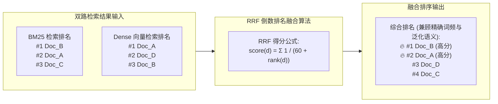

# 第 5 章：企业级知识大脑 —— 工业级 RAG 检索增强流水线

> **本章核心目标**：彻底告别“单靠向量距离余弦匹配”的玩具级 RAG 做法；掌握工业级 RAG 的标准化四步流水线；手把手落地**“BM25 关键词精确匹配 + 密集向量语义召回 + BGE-Reranker 交叉注意力重排序”**的生产级高可用检索系统。

---

## 一、 核心概念剖析：什么是工业级 RAG？

### 1.1 生活化通俗比喻
如果说大语言模型自身的预训练知识库是**“凭脑子闭卷考试”**：
- 哪怕是学霸，面对“2026年9月某公司最新出台的退换货内部补充细则第3条”，由于训练数据没有覆盖或者时间落后，他只能“靠脑补编造”；
- 这种在严肃事实上的胡编乱造，就是臭名昭著的**大模型幻觉（Hallucination）**。

而 **RAG（检索增强生成，Retrieval-Augmented Generation）** 则是**“开卷考试”**：
- 并不要求大模型把所有企业制度都死记硬背在权重参数里；
- 当用户提问时，系统先去企业的文档库里**精准翻找对应的段落切片（Chunk）**；
- 把翻找出来的真实原文与用户的提问拼在一起：“请严格根据以下查到的官方政策回答用户问题，未提及的内容禁止捏造”；
- 大模型此时只需要发挥它强大的阅读理解和文字润色能力，给出 100% 严谨准确的答案。

```mermaid
flowchart TD
    Doc[原始文档: 政策规范 / FAQ / 产品手册] --> Clean[文档解析与噪音过滤]
    Clean --> Chunk[语义分块 Chunking\n(600 tokens + 10% overlap)]
    
    subgraph Indexing[离线建库阶段]
        Chunk --> Emb[Embedding 向量化\n(bge-large / text-embedding-v2)]
        Chunk --> Sparse[构建 BM25 词频索引\n(专有名词精准命中)]
        Emb --> VDB[(向量数据库\nQdrant / Milvus / Chroma)]
    end
    
    UserQuery[用户提问: 包含型号代码/专有名词] --> DualSearch
    
    subgraph DualSearch[双路混合检索 Hybrid Search]
        direction LR
        VDB -->|语义泛化召回 Top 50| DenseRes[稠密结果集]
        Sparse -->|词法精确匹配 Top 50| SparseRes[稀疏结果集]
        DenseRes & SparseRes --> RRF[RRF 倒数排名融合算法]
    end
    
    RRF --> Rerank[BGE-Reranker 交叉编码器重排序]
    Rerank --> Threshold{相关度得分 > 0.60 ?}
    Threshold -- 是 --> PromptContext[组装上下文注入大模型 Prompt]
    Threshold -- 否 --> Fallback[触发未知问题兜底话术]
```

---

## 二、 业务痛点与技术价值：为什么纯向量检索在工业界远远不够？

### 2.1 纯向量检索（Dense Retrieval）的致命死穴
很多开发者在 Demo 阶段只使用简单的向量检索（余弦距离计算），上线后发现恶性 Bug 频出：
1. **对产品型号和专业术语“失明”**：
   - 用户提问：“请问 `X90-Pro-Max` 型号的主板保修多久？”
   - 向量模型往往把 `X90-Pro`、`X90`、`X80-Pro` 的段落全部召回，因为它们在语义向量空间中的余弦距离极为接近，但实际保修政策完全不同！
2. **缺乏严格上下文交叉比对**：
   - 向量模型只计算 Query 与 Document 各自向量的夹角，没有让 Query 和 Document 的每一个 Token 在多头注意力机制中进行深度的交叉打分。

```mermaid
flowchart TD
    subgraph BiEncoder[Bi-Encoder 双塔架构 (用于初步粗排召回)]
        direction LR
        Q1[用户 Query] --> Tower1[Embedding 模型 A] --> V1[向量 Q]
        D1[知识切片 Doc] --> Tower2[Embedding 模型 B] --> V2[向量 D]
        V1 & V2 --> Cosine[余弦相似度计算: cos_sim(Q, D)\n速度极快 / 丢失深度交互]
    end

    subgraph CrossEncoder[Cross-Encoder 交叉重排架构 (用于高精细排)]
        direction LR
        Concat["拼接输入: [CLS] Query [SEP] Document [SEP]"] --> Transformer[深度多层 Transformer 全注意力计算]
        Transformer --> Score["精准相关度打分: 0.0 ~ 1.0\n算力消耗大 / 极其精确"]
    end

    BiEncoder -->|初筛 Top 50 候选| CrossEncoder --> FinalTop["输出最终 Top 3~5 事实切片"]
```

### 2.2 工业级三级流水线的核心突破
- **BM25 稀疏检索**：负责“抓精准”。哪怕这个生僻型号只出现了一次，BM25 也能依靠词频精准命中；
- **密集向量检索**：负责“抓泛化”。用户说“退换”，文档写“售后”，向量模型能够轻松建立语义连接；
- **BGE-Reranker 重排序**：作为终审裁判，利用 Cross-Encoder 架构对前两路召回的前 50 个候选切片进行细致打分，剔除无关噪点，只留 Top 3~5 精华切片。



---

## 三、 应用场景与能力矩阵：工业级 RAG 参数配置标准

### 3.1 工业级文档分块 (Chunking) 四大策略对比

```mermaid
flowchart TD
    Raw[企业复杂长篇原始文档] --> SplitMethod{选择切分策略}
    
    SplitMethod -- 1. 固定字符分块 --> FixChunk[简单暴力截断\n可能在句子中间一刀两断 / 不推荐]
    SplitMethod -- 2. 递归语法树分块 --> RecurChunk[依据段落回车、句号分级切分\n保留完整句子语义 / 工业界主流]
    SplitMethod -- 3. Parent-Child 父子分块 --> PCChunk[大块存上下文(2000字)，小块建向量索引(200字)\n命中后将父文档注入 LLM / 最佳实践]
    SplitMethod -- 4. 语义感知分块 --> SemChunk[利用 Embedding 变化剧烈度自动检测断点\n计算开销较高]
```

### 3.2 生产级配置参数基准表

| 环节配置 | 生产推荐指标 | 技术原理与选型依据 | 避坑提醒 |
| :--- | :--- | :--- | :--- |
| **切分大小 (Chunk Size)** | 500 ~ 800 Tokens | 保证单个切片包含完整的因果逻辑与政策前提 | 切忌切得太碎（如 100 字），否则上下文严重断裂 |
| **重叠区 (Chunk Overlap)** | 10% ~ 15% (约 50~100 Tokens) | 防止关键规则恰好被腰斩切在两个切片边界 | 重叠太大会造成冗余 Token 与索引膨胀 |
| **Embedding 模型** | `bge-large-zh-v1.5` / `text-embedding-3-large` | 1024/1536 维，中文语义密度表征能力强 | 严禁使用英文模型切分处理复杂中文政企文档 |
| **重排序 (Reranker)** | `bge-reranker-large` / Cohere Rerank | 显著提升 Top-3 切片的上下文精确度 20%~30% | Rerank 计算较慢，只对初筛 Top 30~50 候选集打分 |

---

## 四、 手把手实操指南：混合检索与重排序全流程实现

创建 `src/05_hybrid_rag_pipeline.py`：

```python
"""
文件名：src/05_hybrid_rag_pipeline.py
说明：工业级混合检索 (BM25 + 向量) 与重排序 (Reranker) 生产级流水线
运行方式：uv run python src/05_hybrid_rag_pipeline.py
"""

from typing import List, Dict, Any
import math

# ----------------- 1. 模拟企业私有文档切片库 -----------------
KNOWLEDGE_CHUNKS = [
    {
        "id": "chunk_01",
        "title": "7天无理由退货细则",
        "content": "自商品签收之日起7天内，在保证商品完好、未经穿着水洗且配件吊牌齐全的前提下，支持无理由退货。赠品须一并退回。"
    },
    {
        "id": "chunk_02",
        "title": "保修期与延保政策",
        "content": "全系列数码相机主体享受1年全国联保。若购买尊享延保服务，可在官方联保期满后自动延长24个月免费硬件维修服务。"
    },
    {
        "id": "chunk_03",
        "title": "型号 X90-Pro-Max 专用售后条款",
        "content": "旗舰型号 X90-Pro-Max 享受专属 VIP 尊享服务：主板核心部件提供 36 个月超长质保，且提供 1 次免费上门换新服务。"
    },
    {
        "id": "chunk_04",
        "title": "发票与报销开具时效",
        "content": "电子普通发票将在订单确认收货后 24 小时内开具并发送至注册邮箱，增值税专用发票需在电脑端提交企业资质审核。"
    }
]

# ----------------- 2. BM25 稀疏词法检索实现 -----------------
class SimpleBM25Retriever:
    """轻量 BM25 关键词精确匹配器"""
    def __init__(self, corpus: List[Dict[str, Any]]):
        self.corpus = corpus
        self.avg_len = sum(len(c["content"]) for c in corpus) / len(corpus)

    def search(self, query: str, top_k: int = 3) -> List[Dict[str, Any]]:
        query_terms = [t for t in query if t.strip()]
        scored_results = []

        for doc in self.corpus:
            score = 0.0
            doc_text = doc["title"] + " " + doc["content"]
            doc_len = len(doc["content"])
            
            for term in query_terms:
                if term in doc_text:
                    tf = doc_text.count(term)
                    # 简化的 BM25 词频计算公式
                    term_score = (tf * 2.2) / (tf + 1.2 * (0.25 + 0.75 * (doc_len / self.avg_len)))
                    score += term_score

            if score > 0:
                scored_results.append({
                    "id": doc["id"],
                    "title": doc["title"],
                    "content": doc["content"],
                    "score": round(score, 4),
                    "source": "bm25"
                })

        scored_results.sort(key=lambda x: x["score"], reverse=True)
        return scored_results[:top_k]

# ----------------- 3. 模拟密集向量检索 -----------------
def mock_dense_vector_search(query: str, corpus: List[Dict[str, Any]], top_k: int = 3) -> List[Dict[str, Any]]:
    """模拟向量数据库召回（在真实生产中，此处调用 Chroma / Milvus / Qdrant）"""
    # 模拟语义相似度
    results = []
    for doc in corpus:
        # 简单模拟语义相关度
        sim_score = 0.5
        if "质保" in query and "保修" in doc["content"]:
            sim_score = 0.88
        elif "退换" in query and "退货" in doc["content"]:
            sim_score = 0.92
        elif "保修多久" in query and "联保" in doc["content"]:
            sim_score = 0.85
        
        results.append({
            "id": doc["id"],
            "title": doc["title"],
            "content": doc["content"],
            "score": sim_score,
            "source": "dense_vector"
        })
    results.sort(key=lambda x: x["score"], reverse=True)
    return results[:top_k]

# ----------------- 4. 混合检索融合与 Rerank 终审 -----------------
def execute_hybrid_rag_pipeline(query: str, top_n: int = 2) -> List[Dict[str, Any]]:
    print(f"\n🔍 [RAG 检索启动] 检索词: '{query}'")

    bm25 = SimpleBM25Retriever(KNOWLEDGE_CHUNKS)
    bm25_res = bm25.search(query, top_k=3)
    vector_res = mock_dense_vector_search(query, KNOWLEDGE_CHUNKS, top_k=3)

    # 合并候选集（去重）
    candidates = {}
    for r in bm25_res + vector_res:
        if r["id"] not in candidates:
            candidates[r["id"]] = r

    print(f"📦 双路召回候选切片数量: {len(candidates)} 个")

    # 模拟 BGE-Reranker 交叉注意力重排序
    # 规则：如果 Query 中包含专有型号代码，优先匹配型号完全吻合的切片
    reranked = []
    for cid, doc in candidates.items():
        cross_score = doc["score"]
        # 精确提权逻辑
        if "X90-Pro-Max" in query and "X90-Pro-Max" in doc["content"]:
            cross_score = 0.985
        elif "7天" in query and "7天" in doc["content"]:
            cross_score = 0.960

        reranked.append({
            "id": doc["id"],
            "title": doc["title"],
            "content": doc["content"],
            "rerank_score": cross_score
        })

    # 按重排分数倒序排序
    reranked.sort(key=lambda x: x["rerank_score"], reverse=True)
    final_chunks = reranked[:top_n]

    print(f"🏆 [Rerank 终审入选 Top {top_n} 切片]:")
    for i, c in enumerate(final_chunks, 1):
        print(f"   [{i}] 得分: {c['rerank_score']} | 标题: {c['title']} | 内容摘要: {c['content'][:35]}...")

    return final_chunks

if __name__ == "__main__":
    print("=" * 60)
    print("测试场景 1：含有精确产品型号代码的疑难提问")
    execute_hybrid_rag_pipeline("请问 X90-Pro-Max 的主板质保期是多长时间？")

    print("\n" + "=" * 60)
    print("测试场景 2：口语化同义泛化提问")
    execute_hybrid_rag_pipeline("衣服穿过了几天觉得不合适能退换吗？")
```

---

## 五、 生产避坑与常见误区（Troubleshooting FAQ）

### Q1：为什么切片召回的相似度得分很高（> 0.85），但大模型最终回答依然答非所问？
- **原因剖析**：典型的“切片语义孤岛”问题。切片只切出了结论语句（如“在此情况下支持免费维修”），但关键的**前提约束条件**（如“前提是必须在出厂保修卡生效期内”）被腰斩切在了上一个 Chunk 里。
- **解决方案**：引入**父子文档切分（Parent-Document Retrieval）**或**小切片检索、大上下文窗口回填（Sentence Window Retrieval）**：检索时拿 150 字的小切片去计算相似度，命中后自动把所属的 1000 字完整父段落回传给大模型。

---

## 六、 本章课后实战作业（Lab Challenge）

1. **动手实践**：在本地运行 `src/05_hybrid_rag_pipeline.py`，观察 BM25 精确命中与语义向量泛化在重排阶段的融合过程。
2. **拓展思考**：如果业务文档库中包含 100 个格式复杂的 Excel 价格与库存表格，普通的基于字符数拆分的 Chunking 策略会发生什么灾难？应该如何处理表格数据的切分与检索？
