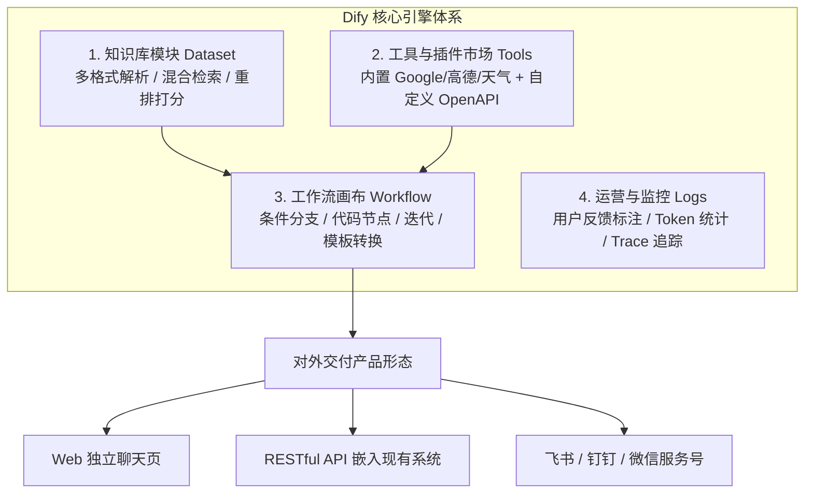
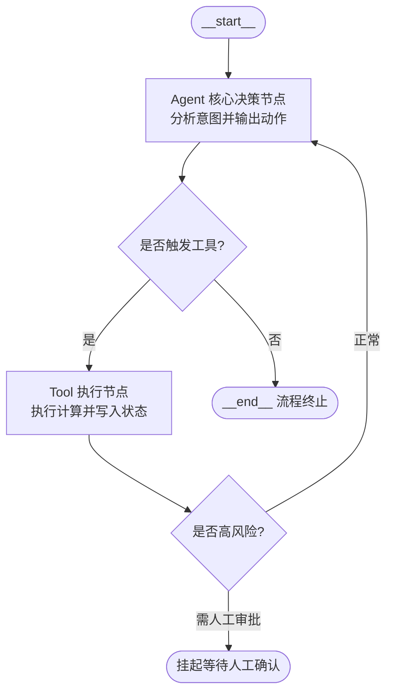
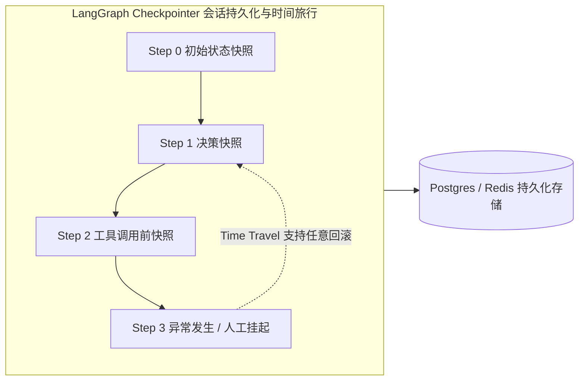
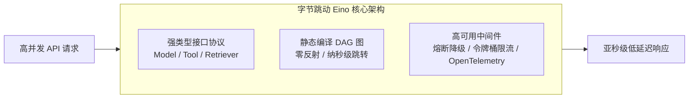
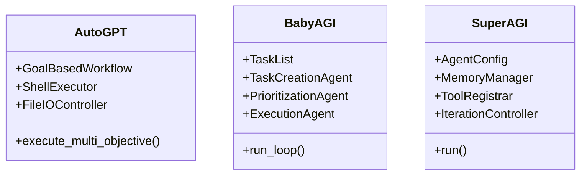
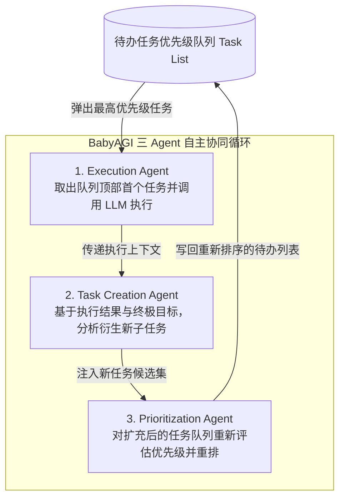

# 第六章：现代编排框架与开源生态篇 —— Dify、LangGraph、Eino

> **导读**：当掌握了 Prompt 工程、RAG 检索增强与 Tool Calling 工具调用后，如何将这些积木高效组织为具有**高容错性、确定性流转、可扩展性**的企业级生产系统？本章重点对比并深度实操三大不同层级的编排方案：**低代码领域的工业标准 Dify**、**代码编排领域的灵活霸主 LangGraph**、**字节跳动高并发微服务领域的 Eino**，并逐行解密业内经典的开源自主 Agent 项目架构。

---

## 6.1 编排框架的核心价值（4步教学法）

### 6.1.1 【是什么（Concept）】
如果说大语言模型（LLM）是计算机的 **CPU**，那么**Agent 编排框架（Orchestration Framework）就是操作系统的任务调度器（Task Scheduler / Process Manager）**。

编排框架的核心使命，是将离散的大模型调用、向量数据库检索、业务 API 请求、用户交互确认按照严格或自适应的拓扑逻辑（DAG 有向无环图或 StateGraph 状态图）连接起来，并在各个执行节点之间安全、有序地传递结构化上下文状态（State）。

| 框架类别 | 代表技术 | 学习曲线 | 适用角色 | 核心优势 |
| :--- | :--- | :--- | :--- | :--- |
| **低代码/可视化平台** | **Dify**, Coze, FastGPT | ⭐（极低） | 业务专家、产品经理、全栈开发 | 开箱即用、可视化画布、内置知识库与插件 |
| **代码级状态图框架** | **LangGraph**, LlamaIndex Workflows | ⭐⭐⭐（中等） | Python/AI 工程师、后端架构师 | 状态持久化、环状循环、分支重试、细粒度控制 |
| **高并发服务级框架** | **Eino (字节跳动)** | ⭐⭐⭐⭐（较高） | Go 语言服务端专家、架构师 | 静态类型安全、零反射极致性能、生产级中间件 |

---

### 6.1.2 【为什么需要它（Why）】
许多初学者习惯在 Python 脚本中用简单的 `if...else` 或 `while` 循环串联大模型 API。但在真实商业生产中，这种“裸奔代码”会迅速遭遇以下四大致命瓶颈：
1. **状态污染与丢失（State Drift）**：多轮对话和工具交互中，上下文变量随处散落，难以实现时间旅行（Time Travel）和会话断点恢复。
2. **缺乏环路与自愈能力（No Looping Control）**：早期线性链（如 LangChain 早期 SequentialChain）只支持从左向右的单向流，一旦中间工具执行报错，无法优雅回退或重新规划。
3. **高并发与内存泄漏**：缺乏统一的会话持久化层（Checkpointer），海量用户并发接入时导致进程阻塞或内存崩溃。
4. **无法实现人机协同（Human-in-the-loop）**：对于退款、发货、删库等危险操作，裸写代码极难做到“执行到某节点暂停等待人工审批，审批通过后原地恢复运行”。

---

### 6.1.3 【能做什么（What）】
利用成熟的编排框架，企业可以构建出高稳定、可观测的复杂自动化业务流：
- **电商多技能客服中心**：自动识别用户意图，流转至售前导购、物流查询或售后退款分支。
- **自动化代码研发助手**：生成代码 → 静态检查 → 单元测试 → 失败自动反馈 LLM 修复 → 成功后提 PR。
- **金融风控与投资研报生成**：多智能体协作（收集宏观数据、财报解析、舆情监控），汇总后由主审 Agent 交叉校验。

---

## 6.2 零代码/低代码工业基座：Dify 全流程搭建实战

Dify 是目前全球被企业采纳最广泛的开源大模型应用开发平台，提供了可视化的 Prompt 编排、企业知识库向量切分、工具市场以及强大的 Chatflow 工作流引擎。



### 6.2.1 手把手搭建电商客服 Agent 实操步骤

```mermaid
flowchart LR
    StartNode([用户开始对话]) --> FilterNode[敏感词与反作弊节点]
    FilterNode --> ClassifierNode{Dify 意图分类器节点}
    
    ClassifierNode -- 售后政策咨询 --> KBNode[知识库检索节点\n(混合检索 + BGE Rerank)]
    ClassifierNode -- 物流订单查询 --> ToolNode[自定义 HTTP 工具节点\n(调用外部 ERP 查询)]
    ClassifierNode -- 闲聊与打招呼 --> DirectNode[LLM 快速问答节点]
    
    KBNode --> FormatNode[LLM 组装综合节点\n(注入语气约束与规范)]
    ToolNode --> FormatNode
    DirectNode --> EndNode([输出渲染卡片 / 微信终端])
    FormatNode --> EndNode
```

1. **第一步：创建企业级知识库**
   - 进入 Dify 控制台，点击顶部【知识库】 → 【创建知识库】。
   - 上传企业售后政策与常见问题文档（支持 txt、markdown、pdf、docx）。
   - **分段与清洗设置**：选择“自动”或“通用分块”，分块长度建议 500~800 字符。
   - **索引方式**：务必勾选【高质量】（调用外部 Embedding 模型），推荐选用 `text-embedding-3-small` 或 `bge-large-zh-v1.5`。
   - **检索设置**：选择【混合检索】，并在重排序模型处配置 `bge-reranker-large`，将相似度阈值设定为 `0.60`。
2. **第二步：挂载自定义业务工具**
   - 进入【工具】页面，点击【创建自定义工具】。
   - 导入你的 ERP 订单查询 OpenAPI 规范（Swagger JSON），Dify 会自动解析出入参定义。
3. **第三步：创建 Chatflow 并发布**
   - 进入【工作室】，创建【Chatflow（对话工作流）】。
   - 在开始节点后连接【意图分类器】节点，分流至“知识库检索”或“工具调用”。
   - 测试无误后点击右上角【发布】，一键获取嵌入式 Web 组件脚本或 OpenAPI 访问密钥。

---

## 6.3 代码级工业标准：LangGraph 状态图架构与实操

传统 LangChain 的线性链（`A -> B -> C`）无法优雅处理复杂的**分支判断、循环尝试（Looping）以及多 Agent 协同**。LangGraph 引入了**有向状态图（StateGraph）**，成为目前最严谨的代码级编排框架。



### 6.3.1 核心架构三要素



1. **State（全局状态载荷）**：整个图流转时共享的数据模型。LangGraph 使用类型注解（如 `Annotated[list, operator.add]`）指定 Reducer，实现消息的自动增量合并。
2. **Nodes（节点）**：普通的 Python 函数或可调用对象，入参为当前 `State`，返回值是一个字典，用来更新 `State`。
3. **Edges（边与条件边）**：
   - 普通边（Edge）：确定性的前驱到后继直接跳转。
   - 条件边（Conditional Edge）：根据前序节点输出的 `State`，动态计算下一个目的节点。

### 6.3.2 独立可运行源码（对应 `src/06_langgraph_workflow.py`）
教程源码目录配套了完整的开箱即跑脚本，包含：
- **状态流转 Reducer**
- **LLM 意图决策节点**
- **工具调用与敏感操作拦截**
- **Human-in-the-Loop 人机审批流**

运行测试命令：
```bash
python src/06_langgraph_workflow.py
```

终端执行日志展示：
```text
🚀 [StateGraph 启动] 入口节点: 'agent'
---> [Step 1] 进入节点: 【agent】
     [AgentNode] 决策: 需要调用高风险工具 'issue_refund'
---> [Step 2] 进入节点: 【tools】
⚠️ [Human-in-the-Loop 拦截] 检测到高风险操作，图状态暂停，等待人工审批...
[管理员操作]: 审核通过！批准退款
[继续图流转]: 【退款系统返回】订单 ORD-2026-8899 成功退款 299.0 元。
```

---

## 6.4 字节跳动高并发开源框架：Eino

在互联网大厂的核心服务端，Go 语言以其极高的并发性能和内存友好性占据统治地位。**Eino** 是字节跳动专门为大模型应用与智能体系统打造的高性能 Go 框架。



### 核心特性
- **强类型与全链路解耦**：将 Model、Prompt、Tool、Retriever 全部抽象为 Go 强类型接口，编译期排查一切类型错误。
- **可视化编排与静态编译**：支持在 IDE 中直接将 DAG 图编译为高效的静态 Go 代码，运行期零反射开销。
- **开箱即用的高可用组件**：内置熔断降级（Circuit Breaker）、并发限流器（Rate Limiter）、分布式分布式链路追踪（OpenTelemetry）。

---

## 6.5 经典开源自主 Agent 架构解密

行业早期涌现了多款里程碑式的开源 Agent 项目，研读其源码机制能极大地开拓架构视野：



### 1. AutoGPT：多目标复杂任务的自动化引擎
- **工作机制**：结合网络搜索、大语言模型调用、文件读写与本地 Python/Shell 脚本执行。
- **Trigger Prompt 范式**：通过结构化的系统提示词强制模型输出当前思考（Thoughts）、推理（Reasoning）、行动计划（Plan）与命令（Command）。

### 2. BabyAGI：任务驱动的自驱循环



- **三大核心协同 Agent**：
  1. **Execution Agent（执行 Agent）**：负责完成当前待办队列顶部的具体子任务；
  2. **Task Creation Agent（任务创建 Agent）**：根据已执行任务的结果和总目标，思考是否需要动态生成新任务；
  3. **Prioritization Agent（优先级排序 Agent）**：重新对待办任务队列进行重要性与紧急程度排期。

### 3. SuperAGI：工业级 Agent 的约束机制
- **约束清单（Constraints）与迭代上限（Max Iterations）**：
  在生产部署中，必须对自主智能体施加硬性边界限制（如 `max_iterations=10`、`constraints=["严禁对生产库执行写操作"]`），这是防止智能体在生产环境中陷入死循环或发生破坏性行为的核心工程底线。

---

## 6.6 生产踩坑排查 FAQ

> **Q1: 为什么我的 LangGraph 在循环反思时陷入了死循环？**  
> **A**: 根因通常是状态未发生实质性变化或缺少**最大迭代步数熔断器**。必须在状态字典中引入 `step_count`，并在条件边函数中添加保护机制：`if state["step_count"] >= 5: return END`。

> **Q2: 企业选型时，应该选 Dify 还是 LangGraph？**  
> **A**: 
> - 如果业务逻辑以“文档检索问答 + 外部标准化 API 调用”为主，且需要业务人员参与调优 Prompt，**首选 Dify**；
> - 如果业务逻辑存在深层状态依赖、需要复杂的环状重试、状态回滚与私有化精细控制，**首选 LangGraph**；
> - 若属于超大规模高并发后端微服务，**推荐选用 Go 语言的 Eino**。

---

## 6.7 课后动手实战与思考题（Lab）

1. **动手练习**：运行 `python src/06_langgraph_workflow.py`，尝试在 `AVAILABLE_TOOLS` 中新增一个 `query_express_trajectory(tracking_no)` 物流轨迹查询工具，并在状态图中新增对应的路由分支。
2. **架构思考**：如果某个工具调用返回了超时（504 Gateway Timeout），你会在 LangGraph 中设计怎样的重试节点和退避（Backoff）策略？
