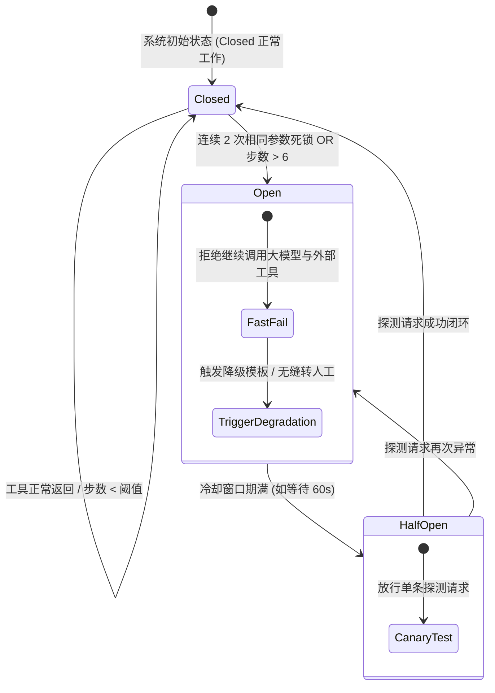
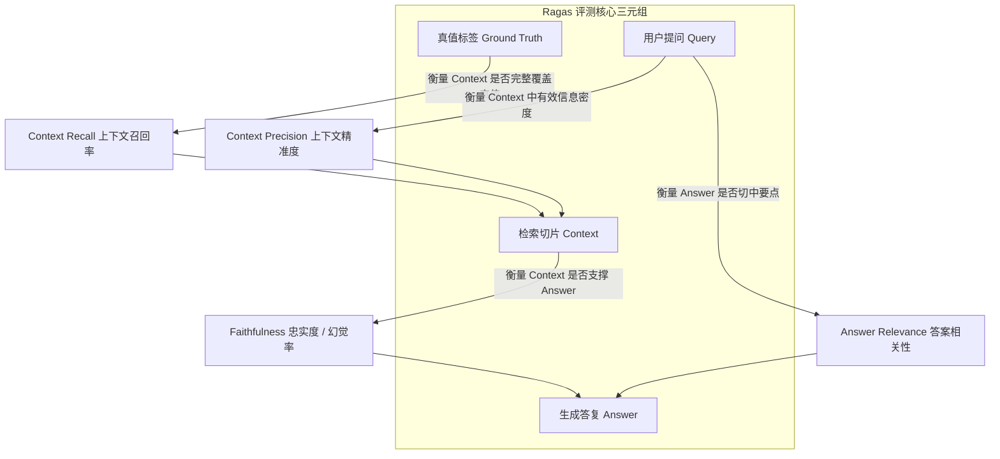

# 第八章：生产级高可用工程化与大厂面试通关篇

> **导读**：掌握了 Agent 的功能开发只是起点，如何让系统在生产环境下承受海量并发、抵御幻觉与死循环、大幅降低 Token 账单？在求职与晋升时，大厂面试官最看重哪些深层架构指标？本章深入拆解**生产级高可用防御矩阵、科学量化评测体系、Prompt Cache 降本实战、STAR 原则高薪简历模版与大厂面试通关真题**。

---

## 8.1 生产级高可用防御矩阵（4步教学法）

### 8.1.1 【是什么（Concept）】
生产级高可用防御矩阵（Production-Grade High Availability Matrix），是指在 Agent 运行时外层构筑的**熔断保护、状态监控、内容安全过滤与降级兜底**机制。它确保大模型在遭遇异常输入、工具故障或自身推理发散时，系统依然能够可控运行而不致崩溃。

### 8.1.2 【为什么需要它（Why）】
在生产环境中，“裸奔”调用大模型 API 会引发三大灾难性事故：
1. **死循环与 Token 账单失控**：大模型调工具报错后，用相同参数反复重试；或两工具互相引用产生死锁，短短几分钟消耗数十万 Token 并导致线程耗尽。
2. **长上下文遗忘（Lost in the Middle）**：多轮会话累积超长上下文后，大模型对中间重要约束产生注意力漂移，遗忘早期业务指令。
3. **严重幻觉与商业违规**：在未检索到准确政策时自行捏造赔偿金额，给企业带来直接经济与法律风险。

### 8.1.3 【能做什么（What）】
构筑生产高可用防御后：
- **Prompt Cache 降低 80% 成本**：静态 System Prompt 与 Tool Schemas 享受大模型服务商缓存折扣；
- **0 死循环事故**：熔断器秒级拦截异常自循环，优雅降级至人工客服或备选方案；
- **全链路可观测**：通过 OpenTelemetry 和指标大盘实时掌握 P99 延迟与工具准确率。

---

## 8.2 核心防御机制与工程落地实操

```mermaid
flowchart TD
    Req["用户请求] --> PromptCache["1. Prompt Cache 缓存优化\n(固定前缀锁定 / 降低 80% 账单)""]
    PromptCache --> LLM[2. 大模型推理引擎]
    LLM --> Breaker{3. Circuit Breaker 熔断检测}
    
    Breaker -- 连续重复调用 --> Block1[🚨 拦截死循环并优雅降级]
    Breaker -- 步数超限 (>6步) --> Block2[🚨 强制终止并落盘快照]
    Breaker -- 正常工具调用 --> Executor[4. 执行外部业务系统]
    
    Executor --> Eval[5. 后置安全审查与事实接地 Grounding]
    Eval --> Out([安全交付用户])


```

### 1. 幻觉产生的本质与工业级四大防御手段
- **本质原因**：大模型本质是基于上文预测下一个 Token 的条件自回归概率分布生成器，缺乏真实的物理世界常识，且训练数据存在噪声。
- **工业界综合防御手段**：
  1. **Grounding（事实接地）**：强制 Agent 优先依据 RAG 检索回的置信切片回答，并要求输出引用来源（Citations）；
  2. **输出强规约（Constrained Decoding）**：利用 JSON Schema 或 Pydantic，将自由发散的自然语言收敛为强类型字段；
  3. **双模型一致性校验（Self-Consistency Checking）**：主模型生成答复草案后，由一个轻量判决模型进行事实一致性核查；
  4. **Temperature 调零**：在涉及查询、计算、工单流转等严肃场景中，将 `temperature` 恒定设为 `0`。

### 2. 长上下文退化与防爆窗策略
- **Memory Summarization（滚动摘要机制）**：维护一个固定大小的滑动窗口（如只保留最近 6 轮对话原貌），更早的历史由后台轻量模型压缩为 200 字的事实摘要（Summary）；
- **动态剪枝（Context Pruning）**：对于已经调用完毕且下游无需再次参考的大型中间 JSON（如查询到的 50 条商品列表），在回传给总控 Agent 时只保留提取出的核心字段；
- **Prompt Cache**：锁定 System Prompt 和 Tool Schemas 为静态前缀，命中服务商缓存机制，降低 50%~80% 的推理成本并提升首字响应速度 40%。

### 3. 防死循环熔断器（Circuit Breaker）实操



配套独立生产级脚本 `src/08_circuit_breaker.py`，支持：
- 连续重复相同调用熔断；
- 全局最大步数超限熔断；
- 乒乓震荡死锁检测。

运行测试：
```bash
python src/08_circuit_breaker.py
```

---

## 8.3 评估体系：如何科学衡量一个 Agent 的好坏？

面试官极爱追问：“你如何证明你的 Agent 优化有效？”必须从**离线评测（Offline）**与**在线监控（Online）**双轮驱动来回答。

### 1. 业界公认 Ragas 评测三元组指标原理



### 2. 生产级全链路可观测体系 (Trace 架构)

```mermaid
flowchart LR
    User["终端用户] --> TraceRoot["Trace ID: tr-2026-9988\n(全链路透传追踪标识)""]
    
    subgraph Spans[Span 调用树]
        direction TB
        S1["Span 1: 网关鉴权与限流 (12ms)"]
        S2["Span 2: 前置 BERT 意图识别 (8ms)"]
        S3["Span 3: 混合 RAG 检索 (45ms)"]
        S4["Span 4: LLM 首字推流 + 生成 (850ms)"]
        S5["Span 5: ERP 工具调用 (120ms)"]
    end
    
    TraceRoot --> S1 --> S2 --> S3 --> S4 --> S5
    Spans --> Collector[OpenTelemetry / Jaeger / Prometheus 监控大盘]


```

### 3. 核心指标评估矩阵

| 评估维度 | 核心指标 | 计算方法与业务意义 |
| :--- | :--- | :--- |
| **理解层** | 意图识别准确率（Intent Acc） | 正确分类的会话数 / 总测试会话数 |
| **工具层** | 工具触发查准率 / 查全率（Precision / Recall） | 是否该调的时候调了？不该调的时候有没有误调？ |
| **执行层** | 端到端任务成功率（Task Success Rate） | 完整闭环完成用户诉求的比例（如成功退款出票） |
| **成本与时延** | P99 端到端耗时与单会话平均 Token 消耗 | 系统是否卡顿？单位商业价值的 Token 成本是否可控？ |
| **稳定性** | 熔断触发率与无感转人工兜底率 | 异常流量与死循环是否被优雅接管？ |

### 4. 业界主流自动化评测工具链
1. **Ragas**：专注于 RAG 管道评估，涵盖**忠实度（Faithfulness）**、**答案相关性（Answer Relevance）**与**上下文召回率（Context Recall）**；
2. **TruLens**：评估 Agent 的工具调用准确率与 RAG 三元组（Triad）；
3. **LangSmith / Phoenix**：提供端到端分布式链路 Trace，追踪每一轮 LLM 调用的 Prompt、Token 消耗与节点耗时。

---

## 8.4 STAR 法则简历打造方案（可直接借鉴）

在向中大厂投递简历时，切忌写成“使用 LangChain 做了个聊天机器人”这种玩具项目。要使用标准 STAR（Situation - Task - Action - Result）法则突出技术深度与量化商业价值：

### 简历项目范例：千万级电商智能客服 Agent 平台架构研发
- **项目背景（Situation）**：公司原有客服系统基于静态正则关键词，多轮对话完成率仅 38%，人工客服成本高昂且晚间响应延迟超过 5 分钟。
- **核心任务（Task）**：主导设计并落地企业级高可用智能客服 Agent 系统，实现售前导购、物流追踪与售后退换货全自动化办理，达成 90% 以上问题 AI 自主闭环。
- **技术行动（Action）**：
  1. 架构上设计**双轨制意图分流网关**，前置自研轻量 BERT 意图分类器，将高频高置信意图在 5ms 内分流，拦截 60% 冗余 LLM 调用；
  2. 构建**工业级混合检索 RAG 管道**（BM25 + 稠密向量 + BGE-Reranker 二次重排），知识命中率提升至 94.5%；
  3. 基于状态机设计**显式对话状态追踪器（DST）**与**人机协作审批断点（Human-in-the-loop）**，保障高危资金操作百分之百合规；
  4. 部署自主研发的**防死循环熔断器（Circuit Breaker）**与 Prompt Cache 机制，死循环故障发生率降为 0，整体 Token 成本削减 62%。
- **商业成果（Result）**：系统日均承接对话 **12 万+ 次**，端到端业务办理成功率达 **81.4%**，客户满意度跃升至 **4.7/5.0**，直接为企业每年削减客服人力成本 **超 300 万元**。

---

## 8.5 大厂面试高频真题与标准答案剖析

### Q1: 在实际业务中，如何解决 Function Calling 参数抽取不全或格式错误的问题？
> **参考标准回答**：  
> 1. **前置约束**：使用 Pydantic 或 JSON Schema 严格定义字段类型、取值枚举（Enum）与 `description` 示例说明，强制模型走 Constrained Decoding；  
> 2. **自反思重试（Self-Correction）**：捕获参数验证错误信息，将原始错误反哺给大模型重新生成，并设定最大重试次数（通常为 2 次）；  
> 3. **降级抽取**：若仍报错，触发传统正则或专用轻量抽取模型进行关键槽位填充兜底。

---

### Q2: 什么是 Prompt Cache？在 Agent 架构中如何组织 Prompt 才能最大限度命中缓存？
> **参考标准回答**：  
> 1. **原理**：LLM 厂商（如 OpenAI、Anthropic、DeepSeek）对相同的 Prompt 前缀计算出的 KV Cache 进行内存或显存驻留，后续相同前缀请求无需重新计算 Attention，大幅降低输入费用与首字延迟；  
> 2. **工程最佳实践**：**“静态在前，动态在后”**。将固定的 System Prompt、全局角色定义、全部 Tool Schemas 集中放在上下文最顶端；将易变的当前时间、用户多轮历史、动态检索知识放在最末尾。严禁在 System Prompt 开头拼接毫秒级时间戳或用户 ID，否则会导致整个 Cache 完全失效。

---

### Q3: 面对企业海量业务数据，在什么场景下应该微调（Fine-Tuning），什么时候应该做 RAG？
> **参考标准回答**：  
> - **微调管“风格、语气、结构格式与领域行为模式”**：如让模型学会输出医疗病历标准格式、金融风控严谨语气、或者低参数量小模型拟合专用 DSL 指令；  
> - **RAG 管“事实知识、实时数据、权限隔离与动态更新”**：如当天更新的电商售后政策、用户私有订单数据、法律条文条款；  
> - **业界最优解是“FT + RAG”双剑合璧**：微调一个小参数模型（如 Qwen2.5-7B）使其具备优秀的 Tool Use 与信息提取能力，在此基础上挂载外置 RAG 知识库与 API，兼顾极低成本与高准确度。

---

## 8.6 课后动手实战与思考题（Lab）

1. **动手练习**：基于 `src/08_circuit_breaker.py`，实现一个“参数漂移探测器”——如果 Agent 连续三次调用同一个工具，但传入的某个数值参数在连续增大（如重试金额从 10 增加到 20 再到 30），立即发出异常风控警报。
2. **架构思考**：若公司需要上线一个“全自动操作真实股票账户”的交易 Agent，你会在哪些环节设置硬性风控开关（Kill Switch）和人工签批门禁？
