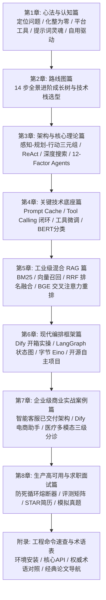

## 🌟 官方全景学习图谱 & 微信交流群推荐

  <h3>🎯 AI Agent 全栈开发与实战学习 · 知识全景大图</h3>
  
把知识串成体系，把想法做成项目。扫码添加作者微信（备注 <strong>「AI Agent」</strong>）获取整套离线资料包、源码工程库，并邀请加入 AI 学习交流圈。

  

    
  

## 教程知识架构全景导图

## 章节快速导航

- [第一章：心法与认知篇 —— Agent 搭建的五大底层逻辑](/guide/01-mindset)
- [第二章：路线图篇 —— Agent 开发与就业 14 步全景进阶路线](/guide/02-roadmap)
- [第三章：架构与核心理论篇 —— 经典 Agent 决策运行体系](/guide/03-core-theory)
- [第四章：关键技术底座篇 —— Prompt、Tool Calling 与微调实战](/guide/04-tech-foundations)
- [第五章：工业级混合 RAG 管道篇 —— 检索与二次重排实战](/guide/05-rag-pipeline)
- [第六章：现代编排框架与开源生态篇 —— Dify、LangGraph、Eino](/guide/06-frameworks)
- [第七章：企业级商业实战案例篇 —— 三大商业项目从 0 到 1 落地](/guide/07-enterprise-cases)
- [第八章：生产级高可用工程化与大厂面试通关篇](/guide/08-production-career)
- [附录：AI Agent 全栈工程命令速查与术语手册](/guide/09-appendix)
