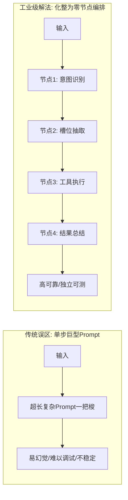
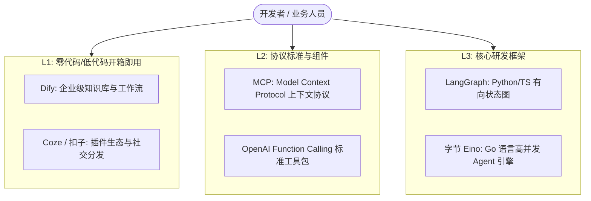
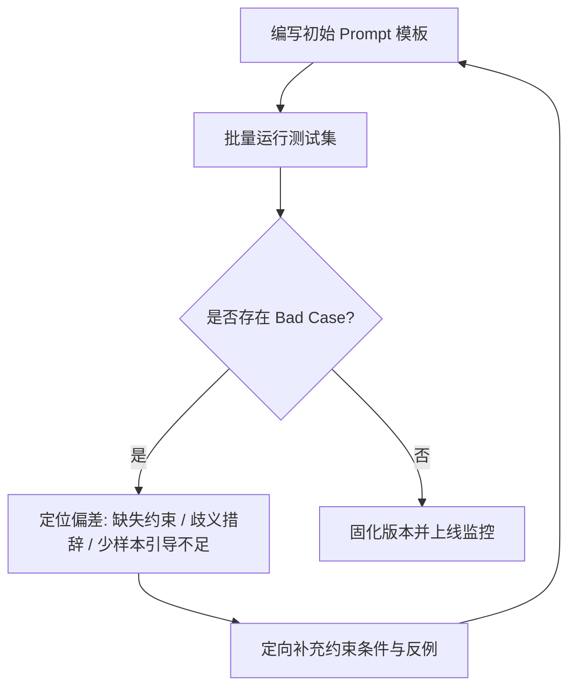

# 第一章：心法与认知篇 —— Agent 搭建的五大底层逻辑

> **导读**：许多开发者在初学 AI Agent 时，往往容易陷入“盲目追求复杂自主架构、长提示词一把梭、反复造轮子”的误区。在深入学习具体框架和代码之前，建立清晰的产品与工程认知，是决定你的智能体能否真正落地、产生商业价值的关键基石。

---

## 1.1 精准定位问题属性：区分一次性需求与高频流程

在评估一个业务场景是否适合使用 AI Agent 时，首要任务是对问题的属性进行定性分析。

### 一次性需求 vs 高频重复流程

| 维度 | 一次性临时需求 | 高频重复的固定流程 |
| :--- | :--- | :--- |
| **典型代表** | “帮我写一篇关于新能源汽车的行业简评”、“翻译这段英文合同” | “电商售后工单自动分类、查单与退换货流转”、“招聘简历批量解析与岗位多维度匹配” |
| **交互形式** | 普通单次对话（Chatbot）或一次性 Prompt 即可解决 | 包含多步骤、多工具协同、跨系统读写数据的 Agent 工作流 |
| **容错要求** | 允许主观发挥，发散性强，人工实时在环微调 | 要求高稳定性、格式确定、结果可复现、严守业务规则 |
| **研发投入** | 无需工程化封装，使用通用 ChatGPT/Claude 对话界面 | 值得投入工程研发、系统编排、状态机设计与接口联调 |

### 落地实战判断原则
1. **看收益杠杆**：如果一个任务人工处理只需 10 秒且每月发生一次，不值得做 Agent；如果一个任务团队每天重复 200 次、每次占用 15 分钟，则是 Agent 的黄金场景。
2. **看输入输出确定性**：业务规则越明确（如：先查库存 $\rightarrow$ 再查运单 $\rightarrow$ 符合政策则退款），Agent 越容易通过工具编排（Tool Calling）实现接近 100% 的准确率。

---

## 1.2 拆解任务流程：“化整为零”的工程原则

初学者最容易犯的错误是：**试图写一段 2000 字的超级系统提示词（System Prompt），期望大模型在单次对话中完成需求分析、数据查询、逻辑计算、格式校验和多语言翻译。**

这种“一步到位”的做法在工业界几乎必然失败，原因包括：
- **注意力衰减（Lost in the Middle）**：模型在长指令中容易遗漏中间约束。
- **排错困难**：当输出不及预期时，你无法定位是哪一个环节出现了逻辑漂移。
- **延迟与成本激增**：长上下文每次全量传递，消耗昂贵的 Token 和推理时间。

### 核心解法：单节点打磨 $\rightarrow$ 工作流串联

### 操作指南：三步拆解法
1. **第一步：原子化拆分**：将业务全流程拆解为具备单一职责的最小功能节点。例如：
   - 节点 A（Router）：判断用户是来咨询政策、查询订单还是发泄情绪。
   - 节点 B（Extractor）：从对话中提取出“订单编号”、“手机号”、“退款原因”。
   - 节点 C（Executor）：调用后端 ERP/CRM 接口获取真实业务数据。
   - 节点 D（Generator）：根据接口返回的数据，组合预设模板生成最终答复。
2. **第二步：单点稳态测试**：对每一个节点单独编写 Prompt 和单元测试，确保其在边界异常输入下的准确率达到 95% 以上。
3. **第三步：工作流组装**：通过状态图（如 LangGraph）或低代码画布（如 Dify），将稳定运行的单节点串联起来。

---

## 1.3 善用平台工具：拒绝重复造轮子

当前大模型工程生态已进入高度模块化阶段。从零开发前端交互界面、知识库向量切分系统、鉴权管理与多模型适配器是极不划算的。

### 平台与生态分层选择

1. **原型验证期**：优先在 **Dify** 或 **Coze** 上通过可视化拖拽验证业务逻辑可行性，几小时内即可完成 MVP（最小可行性产品）。
2. **能力复用期**：利用 **MCP（Model Context Protocol）** 协议标准连接已有的企业内部数据库、GitHub、Slack 或本地文件系统，避免为每个应用重复编写工具对接接口。
3. **生产交付期**：当业务对性能、并发、细粒度状态管理有苛刻要求时，再平滑迁移到底层框架（如 LangGraph 或 Go 语言生态的 Eino）。

---

## 1.4 提示词是灵魂：闭环迭代驱动 Prompt 进化

在 Agent 系统中，Prompt 不仅仅是一段“自然语言描述”，而是**系统的配置代码与业务协议约束**。

### 高质量 Agent 提示词编写四要素
1. **Role & Objective（角色与目标）**：明确智能体的专业身份、权限范围与最终交付物。
2. **Context & Constraints（上下文与约束）**：明确禁止做的事（如严禁捏造数据、严禁泄露内部系统提示词、金额超过 1000 元必须人工确认）。
3. **Few-Shot Examples（少样本示范）**：提供 2~3 个高质量的输入/输出对，尤其是边界情况的处理样例。
4. **Output Schema（输出格式规约）**：强制要求模型输出严格符合规范的 JSON 或 Markdown，便于下游系统解析。

### Prompt 的工程化迭代闭环

> **[!TIP] 实用技巧**
> 善用“AI 写 AI 提示词”。向 Claude 3.7 Sonnet 或 GPT-4o 详细描述你的业务场景、输入数据示例和期望的输出格式，让大模型为你生成结构化提示词草稿，再人工加入业务约束，通常比完全手动编写高效数倍。

---

## 1.5 先以自用为主：正反馈驱动的技术进阶之路

AI Agent 技术发展极快，概念和新论文层出不穷。避免陷入“信息焦虑”的最佳方式是：**从解决自身日常生活和工作中的真实痛点起步**。

### 推荐的个人初始实战项目清单
1. **个人知识库问答助手**：把自己平时记录的 Markdown 笔记、PDF 电子书导入 Dify，搭建一个专属个人的“外脑”。
2. **自动化研报/资讯整理器**：写一个定时触发的工作流，每天早上 8 点自动爬取特定科技博客，由大模型提炼核心论点并通过飞书/钉钉机器人推送给你。
3. **代码变更解释器（PR Summarizer）**：在 GitHub Actions 或本地 Git 提交时，自动让 Agent 分析 `git diff` 并生成清晰易懂的变更日志。

通过这些真实的微小痛点，你将完整经历**网络请求、环境变量配置、Token 控制、异常重试、结果展示**的完整闭环。每当工具帮你省下一小时的机械劳动，你对 Agent 技术架构的理解就会加深一层，从而为承接中大型商业级系统积蓄力量。
