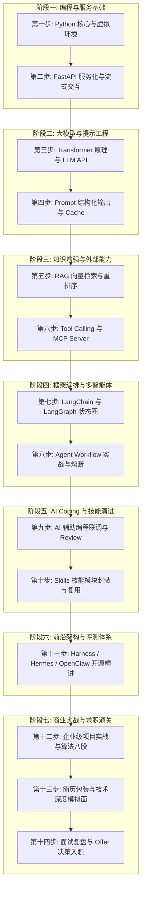

# 第二章：路线图篇 —— Agent 开发与就业 14 步全景进阶路线

> **导读**：本章将 `0.png` 中呈现的“Agent 开发就业路线 14 步”逐一拆解为具体的学习目标、技术栈工具链、实操步骤以及考核指标。无论你是零基础转码、传统后端转型，还是算法工程师探索工程落地，都可以按照此路线图稳步推进。

---

## 2.1 路线图全景总览



---

## 2.2 14 步逐级拆解与落地指南

### 第一步：Python 核心语法与现代工程环境
- **核心知识**：
  - Python 基础语法、函数式特性（lambda、闭包、装饰器）。
  - 面向对象编程（OOP）：类继承、抽象类、魔术方法。
  - 文件 IO 与异步编程：`async` / `await`、`asyncio` 协程、HTTP 异步客户端（`httpx`）。
  - 类型提示与数据模型校验：`typing` 模块与 `Pydantic v2`。
- **环境管理实操**：
  - 使用 `uv` 或 `poetry` 管理依赖，彻底告别全局环境混乱。
  ```bash
  # 推荐使用现代高速包管理器 uv 初始化项目
  curl -LsSf https://astral.sh/uv/install.sh | sh
  uv init agent-demo
  cd agent-demo
  uv add httpx pydantic fastapi uvicorn
  ```
- **达标检验**：能够熟练使用 `Pydantic` 编写带有字段校验、默认值和自定义验证器的数据传输对象（DTO）。

---

### 第二步：FastAPI 服务化、流式输出与模型接入
- **核心知识**：
  - RESTful API 架构设计、路由分发与中间件。
  - **Server-Sent Events (SSE) 流式传输**：Agent 思考和输出过程中的流式打字机效果。
  - CORS 跨域配置与后端错误兜底拦截。
- **实操范例（极简 SSE 流式 Agent 接口）**：
  ```python
  from fastapi import FastAPI
  from fastapi.responses import StreamingResponse
  import asyncio
  import json

  app = FastAPI(title="Agent Service")

  async def event_generator():
      thought_steps = ["正在分析用户意图...", "已定位查询工具...", "正在执行数据检索...", "生成最终回答中..."]
      for step in thought_steps:
          data = json.dumps({"type": "thought", "content": step}, ensure_ascii=False)
          yield f"data: {data}\n\n"
          await asyncio.sleep(0.6)
      yield f"data: {json.dumps({'type': 'answer', 'content': '为您查询到的结果如下：...'})}\n\n"

  @app.get("/api/chat/stream")
  async def chat_stream():
      return StreamingResponse(event_generator(), media_type="text/event-stream")
  ```
- **达标检验**：能使用 `uvicorn main:app --reload` 启动服务，并在浏览器或前端通过 `EventSource` 成功接收流式输出。

---

### 第三步：Transformer 原理、Token 计量与大模型 API
- **核心知识**：
  - Transformer 核心结构（Self-Attention、Encoder/Decoder 区别、KV Cache 原理）。
  - Tokenization 分词机制：BPE（Byte-Pair Encoding）、Tiktoken、中文与英文 Token 消耗差异。
  - 模型生成超参数：`temperature`（控制多样性/创造力）、`top_p`（核采样）、`max_tokens`、`stop_sequences`。
- **统一客户端封装**：
  - 使用官方 SDK 或兼容库（如 `openai` Python SDK）连接各类模型（DeepSeek、GPT-4o、Claude、Qwen）。
- **达标检验**：理解为什么 Temperature 设置为 0 时结果最确定，并能准确计算一段请求中的 Prompt Tokens 与 Completion Tokens 成本。

---

### 第四步：Prompt 工程、结构化输出与 Prompt Cache
- **核心知识**：
  - CoT（Chain of Thought）思维链促使模型输出推理步骤。
  - **结构化输出（JSON Mode / Pydantic Output Parser）**：杜绝模型输出“Markdown包裹的废话”，直接得到可解析字典。
  - **Prompt Cache（提示词缓存）**：
    - Anthropic Claude 与 DeepSeek 均支持的前缀缓存技术。
    - 将不变的超长系统提示词、工具列表、背景文档放在前部，后续对话命中缓存可降低 **50%~90% 的成本** 并显著降低首字延迟（TTFT）。
- **达标检验**：编写一段包含严密 System 提示词的代码，无论用户如何提问，输出格式恒为合法 JSON 且无 Markdown 反引号包裹。

---

### 第五步：RAG 知识检索增强、向量模型与重排序
- **核心知识**：
  - 文档加载与清洗（PDF、Word、Markdown 解析）。
  - 分块切分（Chunking）：字符切分、语义切分、父子文档切分（Parent-Document Retrieval）。
  - Embedding 向量模型与相似度度量（Cosine 距离、Dot Product）。
  - 向量数据库实践（Chroma、Qdrant、Milvus）。
  - **工业级混合检索（Hybrid Search）+ Rerank（重排序）**：
    - BM25 解决专业名词、订单号、编号的精准命中；
    - Dense Vector 解决语义泛化问题；
    - BGE-Reranker / Cohere Rerank 对 Top-K 结果进行交叉注意力重新打分。
- **达标检验**：能够搭建一个本地企业知识库问答 Demo，面对“包含专业编号的生僻条款”，检索召回率在 Top-3 内达到 90% 以上。

---

### 第六步：Tool Calling、Function Calling 与 MCP Server 架构
- **核心知识**：
  - OpenAI Function Calling 规范与底层运行原理（模型只生成 JSON，本地执行代码）。
  - 工具定义 Schema：`name`, `description`, `parameters` 的精确编写技巧（模型靠 description 决定选谁）。
  - **Anthropic MCP（Model Context Protocol）协议**：
    - 统一的跨平台上下文与工具协议；
    - Client-Server 架构，标准 stdio 与 SSE 传输模式；
    - 快速将数据库、Git 仓库、文件系统暴露为标准化 MCP Server。
- **达标检验**：能够为一个大模型挂载自定义工具（如查数据库、调用天气 API、运行一段计算），并完整走完 `模型输出调用意图 -> 本地执行 -> 回传执行结果 -> 模型整合输出` 的闭环。

---

### 第七步：LangChain 与 LangGraph 节点状态图
- **核心知识**：
  - LangChain 核心抽象（PromptTemplate、ChatModel、OutputParser、Runnables/LCEL）。
  - **LangGraph 核心架构**：
    - 解决传统 LangChain 线性链无法处理循环、条件分支和多 Agent 协同的痛点；
    - 核心概念：`State`（全图共享状态字典）、`Node`（处理状态的函数）、`Edge`（连接节点的边）、`Conditional Edge`（根据当前状态动态分支）。
- **实操范例（基础图结构）**：
  ```python
  from typing import TypedDict, Annotated
  from langgraph.graph import StateGraph, END

  class AgentState(TypedDict):
      query: str
      plan: str
      tool_result: str
      response: str

  workflow = StateGraph(AgentState)
  # 添加节点与连接
  # workflow.add_node("planner", plan_step)
  # workflow.add_node("executor", tool_step)
  # workflow.set_entry_point("planner")
  # workflow.add_edge("planner", "executor")
  # workflow.add_edge("executor", END)
  # app = workflow.compile()
  ```
- **达标检验**：能用 LangGraph 构建一个包含“条件判断（无需工具则直接回复，需要工具则路由到工具节点并回环）”的有向状态图。

---

### 第八步：Agent Workflow 实战、多工具协同与熔断保护
- **核心知识**：
  - 路由网关设计（Router Pattern）：多类型请求快速分流。
  - 并行工具调用（Parallel Tool Calling）：一次性并发查询多地天气或多个数据库。
  - **工业级健壮性设计（容灾与熔断）**：
    - 最大迭代轮次保护（`max_iterations`）：严防死循环。
    - 工具异常重试与降级返回（Fallback）。
    - 敏感操作的人机协作（Human-in-the-Loop）：转账、删除数据前挂起等待人工 Approve。
- **达标检验**：在线上环境发生外部工具 500 报错时，Agent 能优雅捕获异常并向用户解释，而不是抛出未捕获的系统崩溃堆栈。

---

### 第九步：AI Coding 辅助开发、联调与边界校验
- **核心知识**：
  - 善用现代化 AI 编程助手（Cursor、GitHub Copilot、Claude Code）。
  - 基于自然语言生成高覆盖率单元测试（`pytest`、`unittest.mock`）。
  - 使用 AI 对复杂 Agent Prompt 进行鲁棒性模糊测试（Fuzz Testing）：输入脏数据、恶意注入提示词（Prompt Injection）。
- **达标检验**：为自己开发的 Agent 核心路由模块编写自动化测试用例，核心分支覆盖率达到 80% 以上。

---

### 第十步：Skills 进化 —— 技能封装与能力复用
- **核心知识**：
  - 将高频业务动作抽象为“技能包（Skills）”：内聚代码、提示词、参考资源与执行脚本。
  - 技能的渐进式加载（Progressive Disclosure）：只在需要时检索并向模型上下文注入相关技能定义，避免 Context Window 被大量无用文档塞满。
  - 跨 Agent 技能共享与标准化定义。
- **达标检验**：实现一个技能管理器，当 Agent 接收到数据分析任务时，按需动态加载数据分析技能规范，执行完毕后自动卸载。

---

### 第十一步：开源自主智能体前沿架构与评测体系
- **核心知识**：
  - 核心评测基准：AgentBench、SWE-bench、GAIA。
  - **Agent Harness 架构**：评测框架如何隔离环境（Docker 沙箱）、记录轨迹日志（Trajectory Trace）并评定完成率。
  - 经典与前沿开源项目架构解构：
    - Hermes / OpenManus / OpenClaw：通用自主执行环境与浏览器/命令行操作交互设计。
    - PI Agent：垂直场景的自主规划智能体。
- **达标检验**：能看懂开源自主 Agent 的事件循环（Event Loop）源码，指出其任务分解、状态暂存与报错回溯机制。

---

### 第十二步：企业级项目实战辅导与算法八股梳理
- **实战辅导**：完成 1~2 个生产可落地的商业化项目（如企业多渠道智能客服系统、医疗多模态问诊系统、金融深度研报 Agent）。
- **算法与高频八股梳理**：
  - RAG 检索退化怎么办？幻觉产生的本质原因与工业缓解手段有哪些？
  - 为什么不能完全用大模型代替传统分类模型？
  - 如何平衡 Agent 的执行准确率与多轮对话的响应延迟？
- **达标检验**：对常见系统设计问题能画出完整架构图，并讲清楚技术选型的权衡（Trade-offs）。

---

### 第十三步：简历指导与多轮模拟技术面试
- **简历打造原则**：
  - 拒绝堆砌“熟练掌握 LangChain”，突出“基于 LangGraph 状态图重构业务流，将多轮任务完成率从 55% 提升至 88%，首字延迟降低 40%”。
  - 采用 **STAR 法则**（Situation 业务背景、Task 核心挑战、Action 架构与算法方案、Result 量化业务收益）。
- **模拟技术面**：经历项目深挖面（追问细节与异常流）、系统设计面（海量并发下 Agent 调度架构）与综合面。

---

### 第十四步：面试复盘、Offer 选择与企业入职准备
- **面试复盘**：建立 Bad Case 记录表，对面试中卡壳的原理题、设计题进行查缺补漏。
- **Offer 评估维度**：业务场景真实性（是否真有高频业务数据落地）、算力与 API 资源支持度、团队技术栈技术深度。
- **入职准备**：熟悉企业私有化部署工具链、内部安全合规规范与业务领域数据特征。
