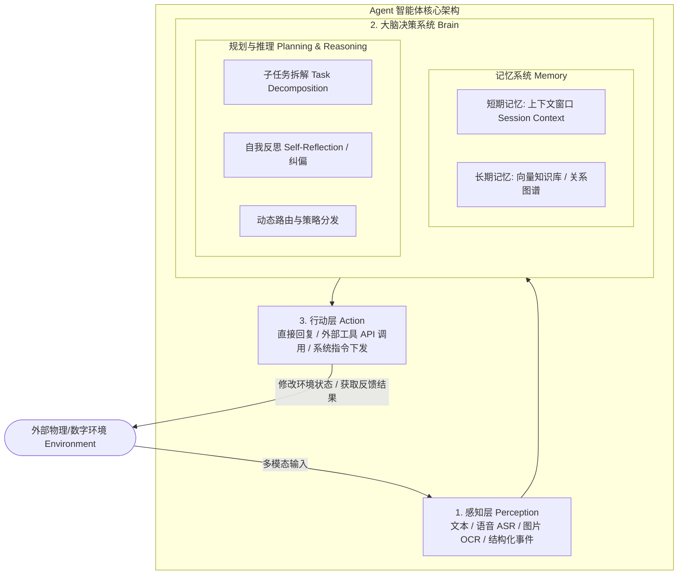
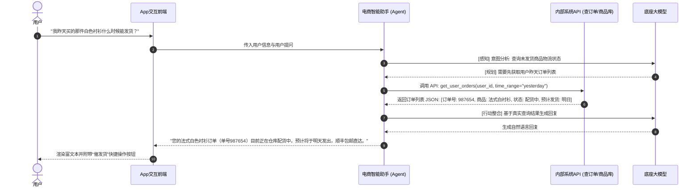
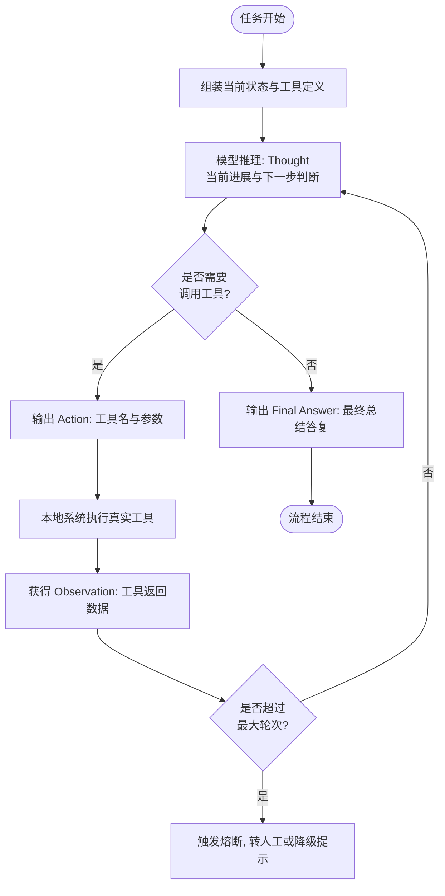
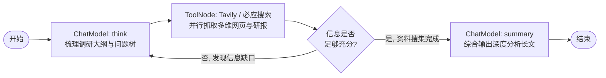

# 第三章：架构与核心理论篇 —— Agent 决策运行体系

> **导读**：大模型（LLM）本身只是一个“文本概率预测机”，它不具备自主行动、长期记忆与环境交互的能力。真正让大模型跃升为“智能体（Agent）”的，是围绕其构建的认知与决策运行架构。本章将系统拆解 Agent 的经典运行三元组、记忆系统、主流规划算法以及生产级设计原则。

---

## 3.1 经典 Agent 决策三元组：Perception → Planning → Action

在业界广泛认可的 Agent 架构定义中（如 OpenAI 研究主管 Lilian Weng 提出的理论框架），一个完整的自主智能体包含三大核心要素：**感知（Perception）**、**大脑规划与记忆（Brain: Planning & Memory）**、**行动（Action）**。



### 1. 感知层（Perception）
- **职责**：将外部复杂、非结构化的环境信号转化为大模型能够理解的标准表示（Tokens 或 Embedding）。
- **常见形式**：
  - 用户自然语言文本输入；
  - 语音流通过自适应 ASR（自动语音识别）转化为带情感标记的文字；
  - 图像/扫描件通过 OCR 或多模态模型提取语义特征；
  - 系统监控指标、Webhook 事件触发包。

### 2. 大脑规划与记忆（Brain: Planning & Memory）
- **规划（Planning）**：负责“先想后做”。面对一个复杂目标（如“帮我制定一份下周去东京的自由行攻略并预订机票”），大脑不会直接盲目生成答案，而是将其分解为：查日历 $\rightarrow$ 查天气 $\rightarrow$ 查航班 $\rightarrow$ 查景点 $\rightarrow$ 整合行程。
- **记忆（Memory）**：
  - **短期记忆（Short-term Memory）**：利用 LLM 的 Context Window 暂存最近几轮对话、当前执行中的中间变量和已调用工具的返回结果。
  - **长期记忆（Long-term Memory）**：利用外部向量数据库（Vector DB）或知识图谱，持久化存储用户的长期偏好、历史工单、领域制度文档。需要时通过语义检索动态召回。

### 3. 行动层（Action）
- **职责**：执行大脑做出的决策指令，对外部环境产生实际影响。
- **常见类型**：
  - **自然语言生成（Text Generation）**：直接向用户输出解释、澄清反问或最终答案。
  - **工具/API 调用（Tool / Function Calling）**：调用高德地图查路线、调用 CRM 系统改订单、调用计算器算税率。
  - **具身操作与代码执行（Code Execution / OS Command）**：在隔离沙箱中运行 Python 脚本处理 Excel，或驱动浏览器自动填表。

---

## 3.2 典型工业探索：以电商智能助手为例

以手淘或大型电商 App 中的“智能导购与售后助手”为例：



---

## 3.3 主流规划范式与算法机制

在实际工程落地中，根据业务复杂度的不同，业界演进出了三种最核心的规划模式：

### 1. ReAct 模式（Reason + Act 循环思考）

ReAct 是目前最通用、最直观的单 Agent 运行范式。模型在每一步交替执行“推理（Thought）”与“行动（Action）”，并根据环境观察（Observation）不断自适应调整下一步行动。



#### ReAct 伪代码与执行骨架
```python
def react_agent_loop(query: str, tools: dict, max_steps=5):
    context = [{"role": "user", "content": query}]
    for step in range(max_steps):
        # 1. 大模型推理当前思维并判断是否调用工具
        response = call_llm(messages=context, tools=list(tools.values()))
        
        # 如果大模型直接输出最终答复，循环结束
        if not response.tool_calls:
            return response.content
        
        # 2. 依次执行大模型请求的所有工具
        for tool_call in response.tool_calls:
            tool_name = tool_call.function.name
            tool_args = json.loads(tool_call.function.arguments)
            
            # 本地运行工具
            tool_fn = tools.get(tool_name)
            tool_result = tool_fn(**tool_args)
            
            # 将执行结果作为 observation 追加至上下文
            context.append(response.message)
            context.append({
                "role": "tool",
                "tool_call_id": tool_call.id,
                "name": tool_name,
                "content": str(tool_result)
            })
    return "已达到最大推理步骤限制，正在为您转接人工坐席。"
```

---

### 2. 深度搜索模式（Deep Research: Think-Search-Summary）

适用于需要海量信息搜集、多轮事实交叉校验的场景（如行业深度研报撰写、竞品全景调研）。



- **Think 阶段**：将大主题自动拆解为 3~5 个关键搜索维度（如市场规模、核心玩家、技术路线、政策风险）。
- **Search/Collect 阶段**：并发调用搜索引擎（如 Tavily API）获取一手网页正文，去除广告干扰。
- **Summary 阶段**：基于收集到的真实事实切片，进行交叉对比，并按照统一的排版格式生成长篇研报。

---

## 3.4 12-Factor Agents 原则与设计哲学

在现代分布式微服务架构中，“12-Factor App”是构建高可用 SaaS 应用的黄金准则。在 Agent 时代，工程团队同样总结出了 **12-Factor Agents** 设计哲学：

1. **单代码库与模块化（One Codebase）**：Prompt、业务逻辑与工具定义版本化受控。
2. **显式依赖声明（Explicit Dependencies）**：严格定义每个 Agent 所需的 LLM 版本、工具库与环境变量。
3. **配置与提示词外置（Config in Environment）**：温度系数、模型名、System Prompt 模板应通过配置中心下发，禁止硬编码。
4. **工具即服务（Backing Services as Resources）**：外部 API、向量数据库均视为可随时替换的松耦合资源。
5. **严格区分构建、发布与运行（Build, Release, Run）**：测试通过的 Prompt 与状态图打包为固定镜像版本再发布。
6. **无状态执行进程（Stateless Processes）**：Agent 单次推理不依赖本地单机内存状态，状态统一托管至 Redis 或 PostgreSQL 状态机。
7. **端口绑定与流式协议（Port Binding & SSE）**：统一暴露标准 REST/SSE/WebSocket 接口，提供打字机式流式体验。
8. **基于图状态的高并发（Concurrency via State Graphs）**：将复杂长链拆解为多节点有向图，无依赖节点并行并发执行。
9. **快速启动与优雅宕机（Disposability）**：节点执行超时应立即熔断回收，不阻塞主会话线程。
10. **环境等价性（Dev/Prod Parity）**：开发、测试、生产环境使用相同维度的向量检索模型与评测集。
11. **全链路可观测性日志（Logs as Event Streams）**：每一步的 Prompt 输入、Token 消耗、工具入参及出参均以轨迹日志（Trace）形式落盘（如 LangSmith / Phoenix）。
12. **管理任务作为一次性进程（Admin Processes）**：知识库向量重构、历史数据清洗作为独立定时批处理任务运行。
