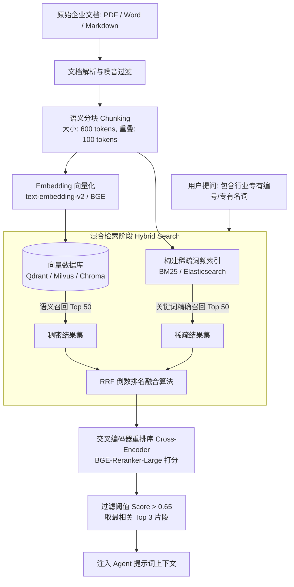
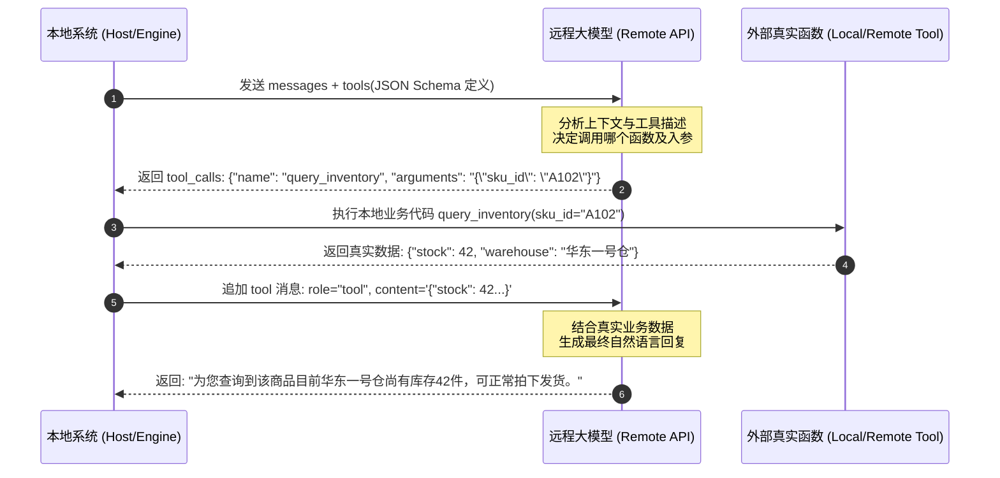

# 第四章：关键技术底座篇 —— Prompt、RAG、Tool Calling 与微调实战

> **导读**：本章是全套教程中**代码与工程实操密度最高**的一章。我们将深入剖析让 Agent 稳定落地的四大技术支柱：**Prompt Cache 技术、工业级 RAG 检索链路、OpenAI/MCP 工具调用协议**，以及如何利用微调（Fine-Tuning）与传统模型强化 Agent 的工具调用与意图识别能力。

---

## 4.1 提示工程进阶：结构化输出与 Prompt Cache

### 1. 结构化输出（Structured Outputs）
在业务系统中，非结构化的闲聊文本极难被程序化消费。必须使用 Pydantic 或 JSON Schema 强制大模型输出合规数据。

```python
from pydantic import BaseModel, Field
from typing import List, Optional

class CustomerIntent(BaseModel):
    intent_type: str = Field(
        description="意图分类: inquiry(咨询), refund(退款), complaint(投诉), other(其他)"
    )
    confidence: float = Field(description="模型对该意图的置信度打分 0.0 到 1.0")
    order_id: Optional[str] = Field(default=None, description="识别出的订单编号")
    urgency_level: int = Field(default=1, description="紧迫等级 1~5，5为最紧急")
    key_entities: List[str] = Field(default_factory=list, description="提取的关键词实体")
```

### 2. Prompt Cache（前缀缓存）的革命性价值
在复杂 Agent 场景中，System Prompt、数十个工具的元数据描述（Tool Schemas）以及先验领域知识往往长达上万 Tokens。每次对话都重新计算这些上下文，既昂贵又缓慢。

- **工作机制**：主流厂商（Anthropic Claude、DeepSeek、OpenAI）对完全一致的 Prompt 前缀直接命中显存中的 KV Cache。
- **降本增效**：
  - 首字延迟（TTFT）降低 **60%~80%**；
  - 缓存命中的输入 Token 计费通常仅为原价的 **10%~20%**。
- **最佳实践**：
  - **静态前置**：将通用的系统角色定义、静态知识、工具定义严格置于提示词最前部；
  - **动态后置**：将易变的用户输入、当前时间、动态会话记录置于末尾，保证最大前缀长度命中。

---

## 4.2 工业级 RAG 检索流水线实战

很多开发者发现自己的 RAG 系统经常“答非所问”，根源在于仅使用了简单的余弦相似度检索。工业级 RAG 必须采用**切分 $\rightarrow$ 混合检索 $\rightarrow$ 重排序（Rerank）**的标准化三级链路。



### 生产级切分与检索配置参考表（对应 5.jpeg）
| 配置项 | 推荐值 | 技术解释 |
| :--- | :--- | :--- |
| **分段设置** | 通用分块（600 Tokens，100 重叠） | 保证段落逻辑完整，重叠区防止语义截断 |
| **索引方式** | 高质量（High Quality） | 自动剔除 HTML 标签、特殊不可见字符与冗余空白 |
| **Embedding 模型** | `text-embedding-v2` / `bge-large-zh-v1.5` | 维度通常为 1024/1536，兼顾泛化性与长句表征 |
| **检索设置** | 混合检索（Hybrid Search） | 兼顾专有名词精确匹配与模糊概念联想 |
| **重排序 (Rerank)** | `bge-reranker-large` | 解决向量只看距离而不看前后文深层语义关联的缺陷 |

---

## 4.3 Tool Calling 与 Function Calling 原理及本地执行闭环

> 核心铁律：大语言模型（LLM）**绝对不能也不会直接去执行你的 Python 函数或操作系统命令**。模型做的事情只有一个：**根据你的函数入参规范，输出一段精确的 JSON 字符串**。

### 完整执行数据闭环（对应 10.jpeg）



### 完整原生 Python 闭环代码实现

```python
import os
import json
from openai import OpenAI

client = OpenAI(api_key=os.environ.get("OPENAI_API_KEY"))

# 1. 定义真实业务工具函数
def query_order_status(order_id: str) -> dict:
    """真实业务系统查询订单接口"""
    fake_db = {
        "20260901": {"status": "运输中", "carrier": "顺丰速运", "eta": "2026-09-23"},
        "20260902": {"status": "待付款", "carrier": "无", "eta": "无"}
    }
    return fake_db.get(order_id, {"error": "未查询到该订单号"})

# 2. 映射工具分发字典
AVAILABLE_TOOLS = {
    "query_order_status": query_order_status
}

# 3. 编写符合 OpenAI 标准的工具描述规范
tools_schema = [
    {
        "type": "function",
        "function": {
            "name": "query_order_status",
            "description": "根据用户的订单编号查询当前物流配送状态与预计送达时间",
            "parameters": {
                "type": "object",
                "properties": {
                    "order_id": {
                        "type": "string",
                        "description": "8位数字订单编号，如 20260901"
                    }
                },
                "required": ["order_id"]
            }
        }
    }
]

# 4. 执行 Agent 调度闭环
def run_agent_conversation(user_prompt: str):
    messages = [
        {"role": "system", "content": "你是一名电商智能客服。遇到需要查订单的问题，请调用工具查询后如实回答。"},
        {"role": "user", "content": user_prompt}
    ]

    # 第一轮：模型决定是否调用工具
    response = client.chat.completions.create(
        model="gpt-4o",
        messages=messages,
        tools=tools_schema,
        tool_choice="auto"
    )
    msg = response.choices[0].message
    messages.append(msg)

    # 检查是否有工具调用
    if msg.tool_calls:
        for tool_call in msg.tool_calls:
            fn_name = tool_call.function.name
            fn_args = json.loads(tool_call.function.arguments)
            
            print(f"[Agent 触发工具] 正在调用: {fn_name}, 参数: {fn_args}")
            # 执行真实本地代码
            fn = AVAILABLE_TOOLS[fn_name]
            result = fn(**fn_args)
            
            # 将执行结果作为 tool 消息回传
            messages.append({
                "role": "tool",
                "tool_call_id": tool_call.id,
                "name": fn_name,
                "content": json.dumps(result, ensure_ascii=False)
            })
        
        # 第二轮：模型结合真实工具返回生成最终答复
        final_response = client.chat.completions.create(
            model="gpt-4o",
            messages=messages
        )
        return final_response.choices[0].message.content
    else:
        return msg.content

# 运行测试
if __name__ == "__main__":
    print(run_agent_conversation("你好，帮我看下订单 20260901 到哪了？"))
```

---

## 4.4 Anthropic MCP（Model Context Protocol）协议

**MCP** 是由 Anthropic 发起并迅速被行业接受的开源标准化协议。它彻底解决了“每个工具都要写一套定制 API 适配层”的行业难题。

```mermaid
flowchart LR
    subgraph Host[Host: 智能体宿主应用]
        AgentCore[Agent 调度引擎 / Cursor / Claude Desktop]
    end

    subgraph MCPServer[MCP Server: 标准化工具与数据源]
        PG[PostgreSQL MCP]
        GH[GitHub MCP]
        FS[本地文件系统 MCP]
    end

    AgentCore <-->|标准 JSON-RPC 2.0 协议\n(基于 stdio 或 SSE 传输)| PG
    AgentCore <-->|标准 JSON-RPC 2.0 协议| GH
    AgentCore <-->|标准 JSON-RPC 2.0 协议| FS
```

- **三大核心能力**：
  - **Tools（工具）**：执行外部操作（如运行 SQL、发送邮件、写文件）。
  - **Resources（资源）**：提供只读数据流（如日志输出、实时指标监控）。
  - **Prompts（提示词模板）**：预设的专业领域问答模板。

---

## 4.5 模型工具能力微调与传统分类模型融合

### 1. 开源模型工具调用微调（基于 XTuner / LLaMA-Factory）
在许多生产专网或数据合规场景下，企业无法直接调用公网商用 API，需要使用私有部署的模型（如 Qwen2.5-7B、InternLM2.5）。为确保这些模型在复杂业务下稳定输出合规的 Tool JSON，通常需要进行微调。

#### 训练数据集标准结构（ShareGPT / OpenAI Function 格式）：
```json
[
  {
    "messages": [
      {
        "role": "system",
        "content": "You are a helpful assistant with access to the following tools.",
        "tools": [
          {
            "type": "function",
            "function": {
              "name": "get_stock_price",
              "description": "获取指定股票代码的实时行情",
              "parameters": {
                "type": "object",
                "properties": {
                  "ticker": {"type": "string", "description": "股票代码，例如 AAPL"}
                },
                "required": ["ticker"]
              }
            }
          }
        ]
      },
      {
        "role": "user",
        "content": "苹果公司现在的股价是多少？"
      },
      {
        "role": "assistant",
        "content": "",
        "tool_calls": [
          {
            "id": "call_12345",
            "type": "function",
            "function": {
              "name": "get_stock_price",
              "arguments": "{\"ticker\": \"AAPL\"}"
            }
          }
        ]
      }
    ]
  }
]
```

---

### 2. 传统意图分类器融合（对应 6.jpeg 工业落地实录）
在高并发场景（如日均 10 万次会话的客服系统）中，**如果每一次用户打招呼或发表情都请求 70B 大模型，服务器成本将极其高昂，且延迟难以接受**。

工业界成熟做法：在 Agent 系统的网关层，前置轻量级的小模型（如 BERT + BiLSTM + CRF 分类器），完成第一道毫秒级分流与槽位提取。

```python
import torch
import torch.nn as nn
from transformers import BertModel, BertTokenizer

class IntentClassifier(nn.Module):
    """
    基于 BERT 的工业级轻量意图分类器
    用于网关层毫秒级前置意图分流 (咨询 / 查单 / 退款 / 闲聊)
    """
    def __init__(self, bert_model_name: str, num_intents: int, dropout_rate: float = 0.1):
        super(IntentClassifier, self).__init__()
        self.bert = BertModel.from_pretrained(bert_model_name)
        self.dropout = nn.Dropout(dropout_rate)
        # 将 [CLS] 标记的 768 维向量映射到具体的业务分类类别数
        self.classifier = nn.Linear(self.bert.config.hidden_size, num_intents)

    def forward(self, input_ids, attention_mask):
        outputs = self.bert(input_ids=input_ids, attention_mask=attention_mask)
        # 获取首个特殊字符 [CLS] 的池化表征
        cls_output = outputs.pooler_output
        cls_output = self.dropout(cls_output)
        logits = self.classifier(cls_output)
        return logits
```

- **实战收益**：
  - 将 60% 以上的高频固定意图在 **10~20ms** 内直接拦截分流，大幅节省 GPU 推理成本；
  - 遇到低置信度、长文本或歧义表达时，无缝降级转发给大模型 Agent 进行深层推理。
