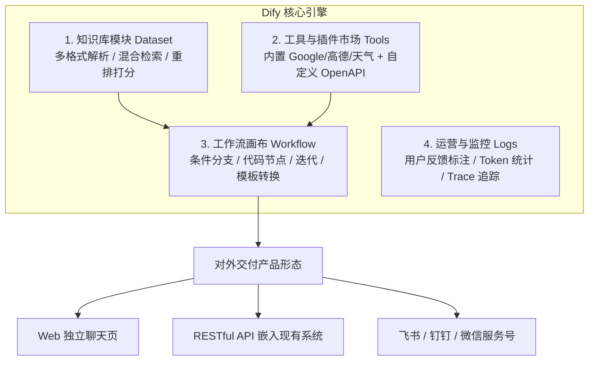
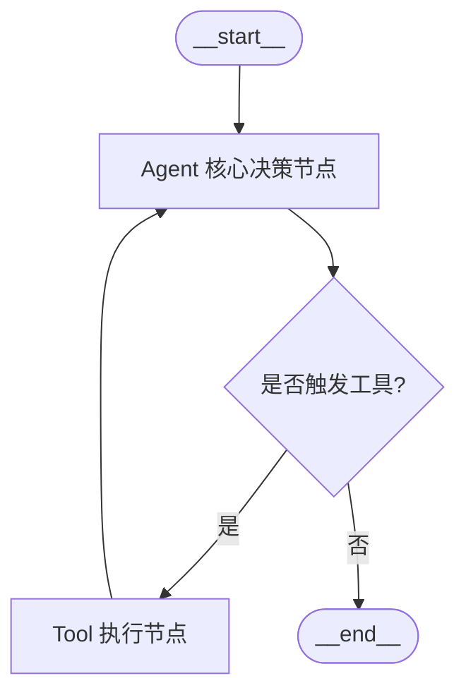
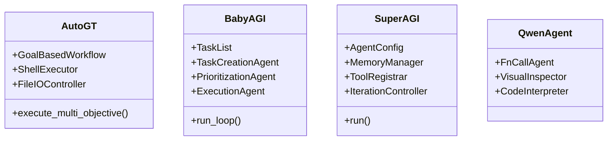

# 第五章：现代编排框架与开源生态篇 —— Dify、LangGraph、Eino

> **导读**：当掌握了 Prompt、RAG 与 Tool Calling 后，如何将这些积木高效组织为具有容错性、可扩展性的生产系统？本章重点对比并实操三大不同层级的编排方案：**低代码领域的工业标准 Dify**、**代码编排领域的灵活霸主 LangGraph**、**高并发微服务领域的字节 Eino**，并解析业内经典的开源自主 Agent 项目架构。

---

## 5.1 零代码/低代码工业基座：Dify 全流程搭建实战

Dify 是目前全球范围内被企业采纳最广泛的开源大模型应用开发平台。它提供了可视化的 Prompt 编排、企业知识库向量切分、工具市场以及强大的 Chatflow 工作流引擎。

### Dify 核心功能模块与定位



### 手把手配置电商客服 Agent 实操步骤（对应 5.jpeg）
1. **第一步：创建知识库**
   - 进入 Dify 控制台，点击顶部【知识库】 $\rightarrow$ 【创建知识库】。
   - 上传企业售后政策与常见问题文档（支持 txt、markdown、pdf、docx）。
   - **分段与清洗设置**：选择“自动”或“通用分块”，分块长度建议 500~800 字符。
   - **索引方式**：务必勾选【高质量】（调用外部 Embedding 模型），推荐选用 `text-embedding-3-small` 或 `text-embedding-v2`。
   - **检索设置**：选择【混合检索】，并在重排序模型处配置 `bge-reranker-large`，将相似度阈值设定为 `0.60`。
2. **第二步：挂载工具**
   - 进入【工具】页面，点击【创建自定义工具】。
   - 导入你的 ERP 订单查询 OpenAPI 规范（Swagger JSON），Dify 会自动解析出入参定义。
3. **第三步：创建 Chatflow 并发布**
   - 进入【工作室】，创建【Chatflow（对话流）】。
   - 在开始节点后连接【意图分类器】节点，分流至“知识库检索”或“工具调用”。
   - 测试无误后点击右上角【发布】，一键获取嵌入式脚本或 OpenAPI 密钥。

---

## 5.2 代码级首选：LangGraph 状态图架构与实操

传统 LangChain 的线性链（`A -> B -> C`）无法优雅处理复杂的**分支判断、循环尝试（Looping）以及多 Agent 协同**。LangGraph 引入了**有向状态图（StateGraph）**，成为目前最严谨的代码级编排框架。



### 完整生产级 LangGraph 代码范例

```python
import os
import json
from typing import TypedDict, Annotated, Sequence
import operator
from langchain_core.messages import BaseMessage, HumanMessage, AIMessage, ToolMessage
from langchain_openai import ChatOpenAI
from langchain_core.tools import tool
from langgraph.graph import StateGraph, END

# 1. 定义工具
@tool
def calculate_freight(weight_kg: float, distance_km: float) -> str:
    """计算大件货物的预估物流运费（单位：元）"""
    base_fee = 15.0
    weight_fee = weight_kg * 2.5
    distance_fee = distance_km * 0.1
    total = base_fee + weight_fee + distance_fee
    return f"重量 {weight_kg}kg，运距 {distance_km}km，预估运费总计: {total:.2f} 元"

tools = [calculate_freight]
model = ChatOpenAI(model="gpt-4o", temperature=0).bind_tools(tools)

# 2. 定义状态结构（支持消息自动追加累积）
class AgentState(TypedDict):
    messages: Annotated[Sequence[BaseMessage], operator.add]

# 3. 节点逻辑：模型推理
def call_agent_model(state: AgentState):
    messages = state["messages"]
    response = model.invoke(messages)
    return {"messages": [response]}

# 4. 节点逻辑：工具执行
def execute_tools_node(state: AgentState):
    messages = state["messages"]
    last_message = messages[-1]
    
    tool_results = []
    for tool_call in last_message.tool_calls:
        tool_name = tool_call["name"]
        tool_args = tool_call["args"]
        # 执行工具
        if tool_name == "calculate_freight":
            res = calculate_freight.invoke(tool_args)
        else:
            res = "未知工具"
        tool_results.append(
            ToolMessage(tool_call_id=tool_call["id"], content=str(res))
        )
    return {"messages": tool_results}

# 5. 条件路由逻辑：判断是继续调用工具还是结束
def should_continue_router(state: AgentState):
    last_message = state["messages"][-1]
    if hasattr(last_message, "tool_calls") and len(last_message.tool_calls) > 0:
        return "tools"
    return END

# 6. 组装并编译图
workflow = StateGraph(AgentState)
workflow.add_node("agent", call_agent_model)
workflow.add_node("tools", execute_tools_node)

workflow.set_entry_point("agent")
workflow.add_conditional_edges(
    "agent",
    should_continue_router,
    {"tools": "tools", END: END}
)
workflow.add_edge("tools", "agent")

app = workflow.compile()

# 7. 运行测试
if __name__ == "__main__":
    initial_input = {"messages": [HumanMessage(content="我有 12kg 的货物要从上海寄到南京，大约 300 公里，算下运费")]}
    output = app.invoke(initial_input)
    print("\n--- 最终输出 ---")
    print(output["messages"][-1].content)
```

---

## 5.3 字节跳动高并发开源框架：Eino

在互联网大厂的核心服务端，Go 语言以其极高的并发性能和内存友好性占据统治地位。**Eino** 是字节跳动专门为大模型应用与智能体系统打造的高性能 Go 框架（对应 3.jpeg）。

### 核心特性
- **强类型与全链路解耦**：将 Model、Prompt、Tool、Retriever 全部抽象为强类型接口。
- **可视化编排与静态编译**：支持在 IDE 中直接将 DAG 图编译为高效的静态 Go 代码，运行期零反射开销。
- **开箱即用的高可用组件**：内置熔断降级（Circuit Breaker）、并发限流器（Rate Limiter）、分布式分布式链路追踪（OpenTelemetry）。

---

## 5.4 经典开源自主 Agent 架构解密（对应 8.jpeg）

行业早期涌现了多款里程碑式的开源 Agent 项目，研读其源码机制能极大地开拓架构视野：



### 1. AutoG-T / AutoGPT：多目标复杂任务的自动化引擎
- **工作机制**：结合网络搜索、大语言模型调用、文件读写与本地 Python/Shell 脚本执行。
- **Prompt 结构**：通过经典的 `Trigger Prompt` 强制模型输出格式如：
  `"user": "Determine which next command to use, and respond using the format: ..."`。

### 2. BabyAGI：任务驱动的自驱循环
- **三大核心 Agent**：
  1. **Execution Agent（执行 Agent）**：负责完成当前队列顶部的具体任务；
  2. **Task Creation Agent（任务创建 Agent）**：根据已执行任务的结果和最终目标，思考是否需要产生新的子任务；
  3. **Prioritization Agent（优先级排序 Agent）**：重新对待办任务队列进行重要性与紧急程度排期。

### 3. SuperAGI：开发者优先的工业级 Agent 框架
- **典型代码配置（对应 8.jpeg）**：
  ```python
  from superagi_client import AgentConfig

  agent_config = AgentConfig(
      name="ECommerce_Analyzer",
      description="自动抓取竞品价格并生成调价建议",
      goal=["分析主要竞争对手的SKU定价", "输出价格调整周报"],
      instruction=["只对比官方自营店铺", "严格遵守抓取频率限制"],
      agent_workflow="Goal Based Workflow",
      constraints=["严禁对生产数据库执行删除操作"],
      tools=[{"name": "WebScraper"}, {"name": "DatabaseWriter"}],
      iteration_interval=500,
      max_iterations=10,
      model="gpt-4o"
  )
  ```
- **价值启发**：SuperAGI 首次规范了 Agent 的“约束清单（Constraints）”与“迭代上限（Max Iterations）”，这是防止智能体在生产环境中发生不可控行为的核心工程机制。
