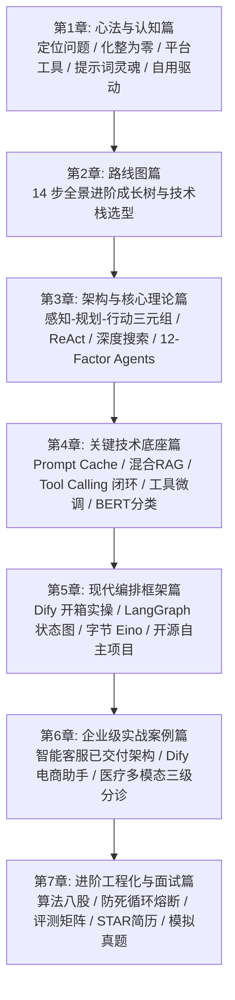

## 教程知识架构总览

## 章节快速导航

- [第一章：心法与认知篇 —— Agent 搭建的五大底层逻辑](/guide/01-mindset)
- [第二章：路线图篇 —— Agent 开发与就业 14 步全景进阶路线](/guide/02-roadmap)
- [第三章：架构与核心理论篇 —— 经典 Agent 决策运行体系](/guide/03-core-theory)
- [第四章：关键技术底座篇 —— Prompt、RAG、Tool Calling 与微调实战](/guide/04-tech-foundations)
- [第五章：现代编排框架与开源生态篇 —— Dify、LangGraph、Eino](/guide/05-frameworks)
- [第六章：企业级实战案例拆解篇 —— 三大商业项目从 0 到 1 落地](/guide/06-enterprise-cases)
- [第七章：进阶工程化与求职面试篇 —— 算法八股与项目通关](/guide/07-career-interview)
